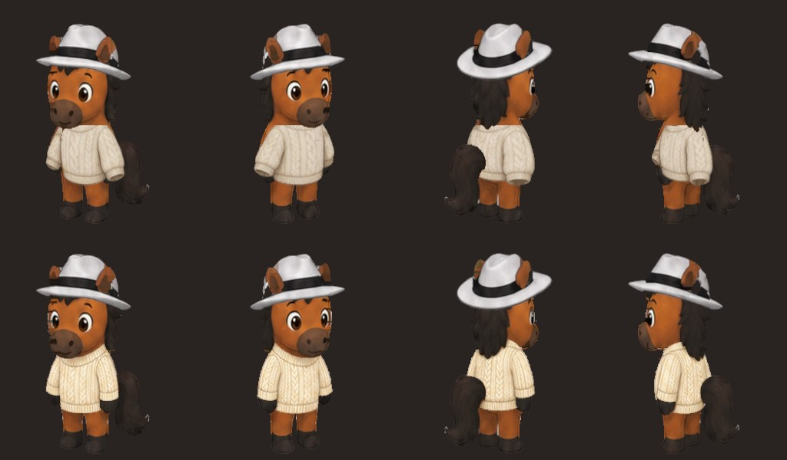
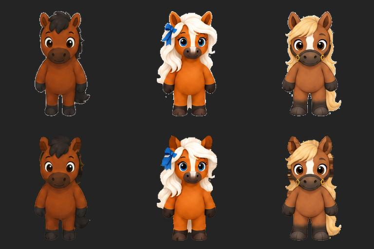
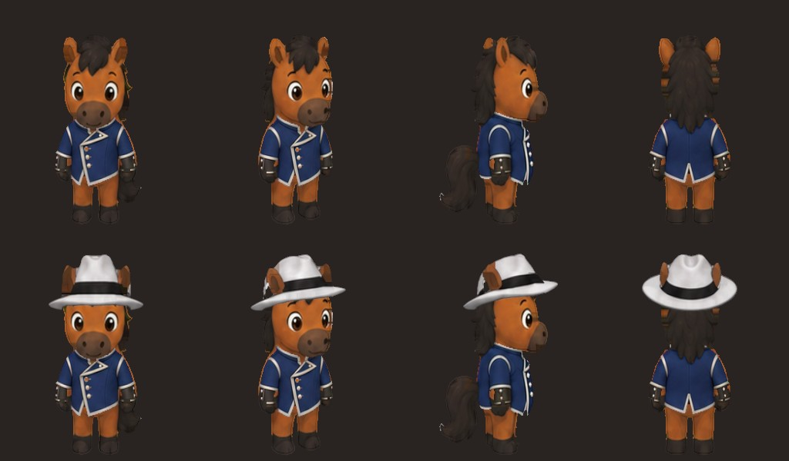
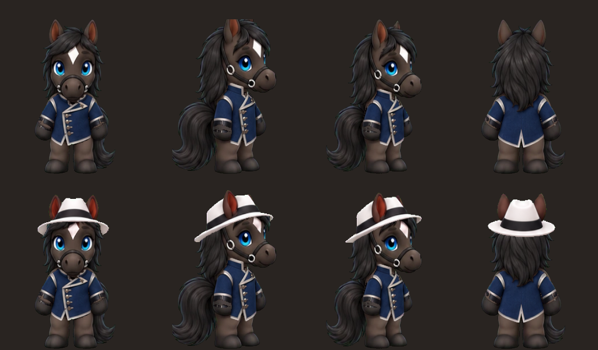

# THE GOLDEN MANUAL
## Modular Character Wardrobe SOP
Eddy + Noir shared wardrobe | Directional sprites in 2D maps and 3D rooms

Version 3.0 | 15 September 2026
Implementation baseline: shared Eddy and Noir equipment, independent fitted atlases, registered open/blink rendering. Prior version-2 behavior is retained.
Asset and module cache tag: 20260915-phoebe2
Audience: artists, technical artists, frontend engineers, QA reviewers and release owners.

Version 3 requires paired Eddy and Noir production for every shared cosmetic. Each item has one catalog ID and separate fitted artwork per character. Version 2 added the swordsman-jacket field test, precise side-profile correction, photograph-based inventory, touch navigation, loading feedback, favorites, saved-versus-preview isolation, cross-system identity handling, and unsaved-exit safeguards. It retains the original technical guidance and distinguishes legacy evidence from current acceptance gates.

This manual records the method that produced the wardrobe revision the user described as "much much better". It documents the current implementation, the failures observed during development, and standards for future work. It is not a claim that every possible item or viewing condition has been solved.

## 00. Mandatory paired-character release standard

Every new or revised shared cosmetic must be created for Eddy AND Noir. One completed fit is not a completed item. This requirement applies to the white fedora, cream cable-knit crewneck (informally called cashmere), charcoal turtleneck, blue swordsman jacket, and future items added to this shared catalog.

One item ID represents the garment design and equipment slot. Two independent asset sets represent its fit. Saved equipment and named/favorite outfit sets are shared by the account; selecting Noir automatically renders Noir's fitted version of the same selected item. Do not duplicate inventory entries or require students to save an equivalent outfit twice.

Release gates:

1. Inspect both canonical standing atlases and their view manifests before authoring.
2. Create a separate worn fitting reference for each character, with every required view.
3. Extract and register separate transparent overlays. Never stretch Eddy's finished overlay onto Noir.
4. Provide character-specific headwear occlusion masks wherever needed.
5. Test all eight current equipment combinations on BOTH characters: bare; hat; each of three tops; hat plus each top. These are runtime QA combinations, not eight separately authored full-body images.
6. Test all 16 standing views in both open-eye and blink states, in the map and actual 3D standing renderer. Examine front, right profile and rear diagonals at enlarged closet scale.
7. Confirm saved-versus-draft isolation, leave/cancel warning, named sets, favorites, remove-all and cross-portal restoration for both characters.
8. Publish only after both fits pass visual review and technical checks. A renderer fallback that silently uses Eddy artwork on Noir is unacceptable.

Historical Eddy-only sections below explain how the original pipeline was developed. This section and section 31 define the current two-character requirement wherever historical wording differs.

## 01. What finally made the clothing fit

The breakthrough was changing the source of the garment shape. We stopped trying to resize an independently drawn sweater until it approximately matched Eddy. Instead, we generated a fitting reference with the sweater already worn on Eddy's canonical poses, then extracted only the garment pixels back into a transparent, full-canvas overlay.

The final game still renders the original Eddy. The generated face, ears, legs, feet, tail and background are not installed as a replacement character. They were useful context for drawing sleeves, cuffs, necklines and hems in the correct places.

The accepted approach has five connected parts:

1. Use one fixed character template with the exact pose and view layout.
2. Draw the item on that template so the garment follows the anatomy.
3. Extract only the garment, preserving its registration to the template.
4. Composite separate equipped items into a cached atlas.
5. Validate the result in the actual renderer, at visible dressing-room scale.

Other necessary fixes were stronger edge-color cleanup, a brim-following hat mask, removal of the old sweater foreground mask, and disabling bare-body optical-flow warping when an outfit is equipped.

The most important lesson: successful deployment and passing functional tests do not prove that clothing looks correct. The user rejected two technically successful releases because the visible improvement was insufficient.



Figure 1. The same rendered angles show the earlier live fit above and the rebuilt overlays below. This is appearance evidence, not a measurement of every possible motion.

## 02. Scope and terminology

CURRENT: Eddy and Noir share one headwear slot and one top slot. The four selectable items are the white fedora, cream cable-knit crewneck sweater, charcoal gray turtleneck sweater and blue swordsman jacket with silver trim. Both characters use the same four catalog items, saved equipment and named outfit sets, with separate character-specific fits.

CURRENT: The closet is a real 3D environment, but the companion is a directional illustrated sprite rendered on a shallow curved plane. Eddy is not a fully rigged 3D body with skinned garment meshes. Calling the room "3D" does not make the clothing a 3D simulation.

CURRENT: Standing characters use 16 illustrated directional views. Open-eye and blink artwork are separate resources. Seated characters retain their distinct artwork and are not dressed by the current standing-outfit system.

CURRENT: Eddy and Noir share the original closet environment and four-item inventory. The room title identifies the selected character. Elsie and Phoebe retain their separate environments and do not receive these unfitted items. All rooms support floor taps, camera gestures and loading feedback. Closet availability and cosmetic-item availability are separate capabilities.

FUTURE: Pants, shoes, necklaces, additional jackets, bags, face accessories, separate arm layers and generalized compatibility masks are extension designs. They are not implemented just because this manual describes how to add them.

Definitions:

- Canonical template: the authoritative character sheet that all cosmetic positions reference.
- Registration: agreement in canvas, position, scale, pose, direction and pivot.
- Atlas: one image containing multiple sprite views in a fixed grid.
- Overlay: a full-canvas image transparent everywhere except the item.
- Occlusion mask: a shape that hides pixels that should be covered.
- Optical flow: a correspondence field used to distort one illustrated view toward another.
- Matte contamination: background color left in edge pixels after background removal.
- Composite: the assembled base character plus equipped layers.
- Fitting reference: temporary artwork used to create a registered item, not an outfit combination shipped wholesale.

## 03. Golden rules

G01. One canonical template per character and pose family. Do not independently resize the head, torso, legs and feet of production sprites.

G02. Item slots and draw layers are different concepts. A jacket can occupy one slot while needing back, torso and front-sleeve layers.

G03. Generate individual items against the character; do not generate every outfit combination. For the shared boys catalog, produce and approve BOTH the Eddy fit and Noir fit in the same work item.

G04. Keep overlays on the full canonical canvas. Cropping for editing is acceptable only if exact placement is restored on export.

G05. Preserve original character identity. A shared item never implies a shared sprite overlay. Never silently replace the base with the body from a generated wardrobe reference.

G06. Judge alpha and edge RGB separately. A file can have transparency and still have a white halo.

G07. Occlusion follows actual shapes. Avoid rectangle-based cuts through hair, arms, collars or tails.

G08. Never use a bare-body deformation field on arbitrary clothing without evidence that its correspondence remains valid.

G09. Perform expensive extraction, cleanup and registration offline. Walking should use prepared assets and cached composites.

G10. Save item IDs and slot assignments, not screenshots of the avatar.

G11. Review every direction, both eye states, equipped and unequipped states, and dark as well as light backgrounds.

G12. Prove visual quality and functional correctness independently. Both are release gates.

G13. Test the exact resource filenames used by runtime metadata, including exceptions.

G14. Keep existing student progress, account isolation and unrelated live features intact.

G15. Treat thresholds and coordinates in this manual as calibrated values for these assets, not universal image-processing constants.

## 04. Why combinations do not multiply the artwork workload

A hat remains a hat overlay. A sweater remains a top overlay. The runtime combines whichever compatible items the student selects.

For H hats and T tops, item production is approximately H + T item sets, while hat-and-top combinations total H x T. Including the empty choice in each slot gives (H + 1) x (T + 1) possible states, subject to compatibility rules.

For the current one hat and two tops, there are six states: bare; hat; cream; charcoal; hat plus cream; hat plus charcoal. We do not need six separately authored full-body sheets.

With 10 hats and 20 tops, 30 item sets support 200 combinations in which both slots are filled. Each set still needs all supported directions and, for any genuine frame animation, matching frames.

Production cost is therefore additive across independent items, multiplied by required views, frames and character templates. It is not free or unlimited. Complicated interacting items can require extra masks or compatibility metadata.

Runtime caching is different from authoring. The application may assemble and cache a chosen combination after equipment changes. That does not mean an artist generated every possible combination in advance.

## 05. Canonical asset contract

The current standing source atlas is 1024 x 1024 pixels: four columns, four rows and sixteen 256 x 256 cells.

Canonical Eddy files:

- assets/speaking-system/mascots/v4/eddy-standing.png
- assets/speaking-system/mascots/v4/eddy-blink.png

Eddy's view angles in metadata are: 0, 30, 60, 75, 90, 115, 145, 160, 180, 210, 235, 250, 270, 300, 330 and 350 degrees.

These are metadata angles. Do not infer a universal camera convention from a row number. Source images can have corrected or mirrored view assignments. Eddy currently maps source cells 0 through 15 directly; the other characters have metadata corrections. Read speaking-mascot-views.mjs instead of assuming all characters share identical cell mappings.

The contract for every exported overlay:

- Exactly 1024 x 1024.
- Same 4 x 4 cell arrangement.
- No view rearrangement or arbitrary mirroring.
- Identical character scale and relative positions.
- Consistent foot ground contact and sprite pivot.
- All required directions present.
- Transparency outside the item.
- No background checkerboard, floor, text, border or external drop shadow.
- No accidental generated face, hands, feet or tail included.
- Sufficient color padding outside the visible alpha edge for texture filtering.

Target fitting landmarks are the neck base, shoulder line, wrist/cuff endpoints, torso center, hip/hem line, tail attachment and hat brim contact. These are more useful than the bounding box of the entire horse, because a tail can shift that bounding box without changing torso position.

For future walking frame animations, registration must hold for each frame, not merely each angle. A garment for a standing pose cannot be assumed to fit moving arms automatically.

## 06. Required source package and file ownership

Keep a reproducible package for every new item:

1. Canonical base and blink references, with their version.
2. Item design reference and visual description.
3. Generation/edit prompt and tool/model provenance when available.
4. Unmodified fitting-reference output.
5. Extraction and registration script or layered native artwork.
6. Exported overlay and any hiding/foreground masks.
7. Inventory thumbnail.
8. Metadata identifying slot, character, pose family and supported views.
9. Before/after review images and test results.
10. Release identifier and asset hashes.

The accepted sweater fitting references are stored in tools/mascot-art/wardrobe/ as cream-tailoring-candidate.png and charcoal-tailoring-candidate.png. The name "candidate" is historical; these files are inputs to the accepted garment extraction pipeline.

Runtime files live in assets/speaking-system/cosmetics/eddy/. Only the derived overlay is needed by the game, not the complete fitting reference.

Known reproducibility limitation: tools/prepare-eddy-cosmetics.py still reads the original fedora and standalone clothing sheets from the author's Downloads folder. The original standalone sweaters are generated first and then replaced by the registered sweater outputs. A clean-machine rebuild therefore still requires those original inputs, even though the final sweater references are checked in.

Required future hardening: move approved original inputs into an agreed source-art location, replace personal absolute-path assumptions with configurable paths, and record input hashes. Do not advertise the current full pipeline as a self-contained clean-room build.

## 07. Artist SOP: design, generate and register

Step 1 - Freeze the template. Confirm character, standing/seated family, dimensions, view order and blink resource. Record the canonical revision.

Step 2 - Define the item. Specify slot, material, silhouette, collar, sleeve length, cuff shape, hem and any body/hair regions it must hide.

Step 3 - Fit on the character. Provide the canonical sheet as the edit target. Request the same garment worn in every cell, with unchanged head identity, scale, pose and placement. Explicitly preserve original wrist hooves and feet.

Step 4 - Reject composition drift. A polished illustration is not automatically a usable sprite atlas. Check view count, view directions, cell placement, body proportions and arm locations before extraction.

Step 5 - Separate artwork from the background. Inspect whether the output truly contains alpha. The cream output in this project contained a baked-in checkerboard; it could not be used directly. The charcoal fitting output used a magenta chroma-key background to make separation more controllable.

Step 6 - Extract garment pixels. Use a method appropriate to the colors and masks of this specific asset. Preserve full-canvas alignment.

Step 7 - Composite over the original base. Inspect all sixteen views with no hat first. The generated face or body must not conceal a registration failure.

Step 8 - Check with the hat. Look for collar collisions, hidden hair, unexpected gaps and incorrect front/back layering.

Step 9 - Inspect on light, dark and midtone backgrounds at actual closet scale. Map thumbnails can conceal defects.

Step 10 - Compare directly with the previous version using the same angles and scale. If the visible difference is not meaningful, do not treat the generation as a successful fix.

Example prompt specification:

```
Edit target: canonical Eddy 4x4 standing atlas.
Change only: add one cream cable-knit crewneck sweater.
Preserve: every cell position, body scale, pose and facing direction;
head, muzzle, ears, mane, tail, wrist hooves, feet and legs.
Fit: sleeves follow the original arms; cuffs stop at the hooves;
neckline under the muzzle; hem at hips; no bare orange torso.
Output: full atlas; no added hats, labels, grid or floor.
Background: true transparency, or an explicitly chosen key color.
Do not create or rearrange outfit combinations.
```

A prompt is a constraint request, not a guarantee. Registration and alpha checks remain mandatory after generation.

## 08. Technical SOP: the accepted sweater extraction

The current extractor is tools/prepare-eddy-tailored-sweaters.py. It processes full-character fitting references but exports only garment pixels.

Operation sequence:

1. Read the appropriate checked-in reference.
2. Convert to RGB and resize the complete reference to 1024 x 1024 using Lanczos.
3. Compute per-pixel color channels and local cell Y using global Y modulo 256.
4. Select candidate garment pixels using calibrated color and vertical bounds.
5. Close small holes with a 3 x 3 maximum filter followed by a 3 x 3 minimum filter.
6. Expand valid garment RGB into adjacent transparent pixels for three passes.
7. Export a lossless RGBA WebP atlas.

Current cream selection, using channel values on a 0-255 scale:

```python
(r > 135) & (b > 80) & (r - g > 5) & (g - b > 6)
& (local_y > 96) & (local_y < 204)
```

Current charcoal selection:

```python
(b > 43) & (r < 150)
& ((max_rgb - min_rgb) < 20)
& (local_y > 96) & (local_y < 204)
```

Cream's warm color separates it from the neutral checkerboard. Charcoal's relatively neutral dark color separates it from the orange body and saturated magenta background. The local Y restriction excludes most heads and feet.

Morphological closing repairs tiny holes in fabric. It is not a fitting algorithm. It can also bridge small intentional gaps, so inspect sleeve and tail cutouts after applying it.

Three passes of RGB padding give filtered texture samples a nearby garment color outside alpha. Padding must not enlarge visible clothing coverage.

Limits:

- These selectors are specific to these source images.
- New colors, necklaces, buttons or patterns may need different segmentation.
- A global resize only works when the generated layout remains sufficiently registered.
- The extraction is not a general automatic garment-fitting or body-tracking system.
- The padding implementation uses array shifts across the atlas. Current garments sit safely away from cell boundaries. A generalized pipeline should clamp operations per cell and test boundary bleed.
- Review the result, not just mask pixel counts.

For future difficult garments, use authored masks or a proper layered source file rather than endlessly expanding color thresholds.

## 09. Hat fitting and hair occlusion

The fedora remains a separate headwear overlay. Its source includes the depicted ears. Original hair and ears beneath the replacement must not show through in incompatible positions.

The original registration pipeline uses the first sixteen source views, isolates the largest connected foreground component in each cell, removes detached speckles, and places each view on the canonical canvas.

Current fedora placement uses width 130, height 67 and local Y 9. Horizontal centers are calibrated per view:

```
125,108,131,150,151,145,141,129,
127,113,114,111,111,111,115,123
```

These numbers describe this artwork. They are not default positions for a new hat or another character.

The failed mask erased a horizontal rectangle across the top of Eddy's head. This left a visibly straight cut behind the brim.

The replacement mask follows the fitted hat. For each column with hat alpha above 100, find its lowest occupied pixel. Hide underlying base pixels from the cell top down to that column's brim boundary. Draw the hat after applying this mask.

Runtime operations are destination-out for the hiding mask, then source-over for the hat.

Review requirements:

- No flat rectangle or straight cut visible behind the brim.
- No original hair peeking through the crown.
- No unintended missing portions of ears.
- No floating hat gap during front, profile or rear views.
- No white wedge or hole caused by warped UV sampling.
- Proper visible brim thickness on a dark background.

For a different hat, derive a new mask from that hat's geometry. Reusing the fedora mask for a helmet, cap or wide-brimmed hat is not acceptable.

## 10. Alpha, edge color and white halos

Transparency has two components: coverage in alpha and color in RGB. Removing a white background from alpha does not necessarily remove the white color already mixed into semi-transparent edge pixels.

In the affected sprite assets, fully transparent RGB was not the only issue. White matte color remained around visible edges. At the small map size it was less obvious; enlarged dressing-room rendering and texture filtering exposed it.

The cleaner in tools/clean-mascot-edges.py runs offline:

1. Find foreground with alpha above 24.
2. Use eight-neighbor connected components to remove isolated components smaller than 20 pixels.
3. Build an opaque interior seed using a 9 x 9 minimum filter on alpha, then threshold above 250.
4. Propagate neighboring interior RGB outward for twelve four-neighbor passes.
5. For visible pixels, use the per-channel minimum of original and propagated RGB. For transparent pixels, use padded RGB.
6. Remove remaining faint pixels below alpha 150 when no interior seed reached them.
7. Save lossless WebP.

The per-channel minimum is an asset-specific safeguard against brightening dark details. An earlier version replaced edge RGB outright and made the fedora rim appear white and blocky. Taking the minimum prevented that brightening, but it can darken colored edges; it is not a universally correct color-unmatting formula.

The stronger interior seed was necessary because the earlier 5 x 5 filter and eight propagation passes left too much visible matte.

Current scope: the cleaner processes all six runtime standing/open and blink resources, plus the fedora. The rebuilt sweater extractor handles its own RGB padding, so those fitted overlays are not passed through this base-sprite cleanup.

Never apply a general "delete white" threshold to the whole character: Elsie's mane and the fedora are genuinely pale. Inspect dark, white and patterned materials separately.

The shader's standing alpha cutoff is 0.42; the seated cutoff remains 0.18. This rejects low-coverage fragments but does not fix white pixels that are already opaque. Excessively raising the cutoff can produce jagged edges or erase fine hair.



Figure 2. Eddy, Elsie and Phoebe on a dark background. Source artwork is above; stronger edge cleanup is below. Genuine pale hair must remain visible.

## 11. Layering: current compositor and future extensions

The current runtime compositor in eddy-cosmetics.mjs is intentionally small:

```
1. Original open-eye or blink base
2. Selected fitted sweater, if any
3. Apply fedora hiding mask, if equipped
4. Draw fedora, if equipped
5. Cache and render the resulting atlas
```

The rebuilt sweaters already include their neck, cuff and tail cutouts. The previous body-front mask is no longer sampled by the runtime compositor for these tops.

Why it was removed: it originally restored all dark body pixels over the sweater, which put hooves through the chest or sleeves. Later revisions narrowed its use, but it still imposed coarse boundaries that could cut across the neckline. Correctly fitted overlays made that generic restore step unnecessary.

body-front.webp remains in the repository as a legacy/generated artifact. Its presence does not mean the runtime still uses it. Do not reintroduce it without a specific demonstrated need.

Future layer architecture can include:

- Back accessory.
- Hair-back.
- Base body.
- Bottoms and shoes.
- Torso clothing and rear arm.
- Held item.
- Front arm.
- Head/face and hair-front.
- Headwear.
- Face accessory and foreground accessory.

Do not implement this entire list for every item. Start with the minimum draw order that produces correct overlap.

For a necklace over a sweater, ordinary layering may be sufficient. If a collar covers the upper chain, split the necklace into back/front parts or apply a clothing-specific visibility mask. If a turtleneck should hide the necklace completely, use a compatibility rule.

These are future metadata examples, not current supported fields:

```json
{
  "slot": "top",
  "character": "eddy",
  "necklaceVisibility": "partial",
  "necklaceMask": "crewneck-necklace-mask.webp"
}
```

General rule: resolve predictable intersections with item metadata and masks. Generate a special combined item only when the design genuinely cannot be represented by the supported layering rules.

## 12. 3D rendering, interpolation and frame behavior

The 3D actor uses a subdivided plane with shallow curvature and shader-driven head/body treatment. Textures are sRGB. Replacement composite textures use linear minification and no mipmaps.

The old renderer used optical-flow fields generated from the bare character to warp neighboring illustrated views. When those fields were applied to a composite containing a fedora and sweater, pixels moved according to bare anatomy rather than clothing edges.

Observed effects included a broken hat brim, triangular gaps and distorted garment silhouettes at intermediate angles. Small garment resizes could not repair this.

The accepted fix keeps optical flow for bare standing Eddy but sets flowStrength to zero when a dressed composite is active. With clothing, the shader selects the nearest authored directional picture rather than warping it. Clearing equipment restores the bare-body behavior.

Tradeoff: equipped turns can appear more stepped because they use sixteen drawn views. This is preferable to presenting a damaged silhouette as a smooth interpolation. A future improvement would require clothing-aware correspondence, more authored directions or a true rigged mesh system.

The standing head/body blend band is [0.49, 0.53] in normalized vertical UV coordinates. The previous [0.38, 0.46] band was suited to the seated treatment and crossed the standing chest. It could make a sweater appear split when head and body chose different views.

The seated band remains [0.38, 0.46]. Do not globally change it to fix standing clothes.

Do not assume that adding one new garment mesh per accessory will preserve current performance. That would change this architecture and needs separate render-budget testing.

## 13. Runtime caching and performance standards

cosmeticAtlas(id, base) returns the original base if the character is neither Eddy nor Noir, the base is not ready or no items are equipped.

For an outfit, required images load once into an image cache. Until all required resources are ready, the base remains available. Image completion triggers listeners so the atlas can be recomputed.

The composite cache key uses the base source URL and equipped-item state. Open-eye and blink bases therefore have distinct cached composites. Equipment/image changes invalidate composites; animation frames reuse the cached canvas.

The 2D map callers are common-expression-map.mjs and writing-chess-map.mjs. The 3D character library replaces atlas textures on the existing actor rather than adding clothing geometry and extra draw passes.

Superseded CanvasTextures are disposed. Actor disposal removes material/geometry resources and unsubscribes equipment listeners.

Current closet optimizations:

- Static opaque room meshes are merged by compatible material and shadow settings.
- Transparent objects and the mirror are kept independent.
- Initial pixel ratio is capped at 1.25.
- The loop monitors slow frames in groups of 24 samples.
- If more than 12 samples are slow, pixel ratio is multiplied by 0.8, down to a floor of 0.65.
- Idle rendering is limited to roughly one render per 32 ms.
- Active interaction is not subject to that idle cap.
- Static shadows are not regenerated continuously.
- Hidden documents stop rendering; visibility changes restart the loop.
- Closing the closet disposes its resources.
- A closet-visibility event coordinates with the surrounding map.

These are implementation facts, not measured guarantees of 60 FPS on every device. Record actual frame times on representative devices.

Target for future QA: stable interaction without recurring long stalls, no increasing GPU resource count after repeated open/close cycles, and no per-frame atlas extraction or upload. Report median, p95 and worst frame time rather than a single optimistic FPS number.

## 14. Equipment, saved avatars and named sets

The catalog contains stable IDs:

- white-fedora -> headwear
- cream-cable-knit -> top
- charcoal-turtleneck -> top
- blue-swordsman-jacket -> top

Clicking an unequipped item equips it in its slot. Clicking the same equipped item again removes it. Choosing any other top replaces the current top while preserving the hat.

Equipment preview and persistence are distinct:

- Equip item: update only the closet preview immediately. Maps and other standing-character renderers continue to use the saved outfit until a successful save.
- Save avatar: persist the current equipment.
- Save outfit set: store the equipment under a user-supplied name and save.
- Click saved set: equip the set and save it.
- Remove all: preview the bare avatar; Save avatar makes that removal persistent.

Closing the closet with a changed outfit must ask whether to discard it. Cancel keeps the closet and draft open. Confirming discard restores the previously saved avatar; it must not write the draft to storage or the server. Remove all is also a draft change until saved. No warning is needed when a user changes items and returns to the original saved equipment.

Named sets are limited to 50; names are trimmed and limited to 1-60 characters. Saving an existing exact name replaces that named set in the current client logic.

Saved sets have a heart control. A true favorite flag is saved with the set, favorites sort first, and replacing a set preserves its favorite status. Favoriting a set does not equip it or save an unrelated outfit preview.

The inventory uses aria-pressed for equipped state, visible Equipped text, a live status region, disabled controls while saving, and a maximum-length name input. Set names are inserted using textContent, not interpreted as HTML.

Adding a new item requires updating the client catalog, extraction/assets, icon, backend allowlist, tests and any slot compatibility behavior. Adding a PNG alone is not sufficient.

## 15. Account persistence and safety

This section describes the checked-in migration and frontend behavior; it is not a new production security audit.

The private table avatar_closet.wardrobes is keyed by student_id and stores equipped JSON, named outfit JSON and updated_at. It references the shared student table.

The public entry point is eddy_closet_sync. Its wrapper is security invoker; the private synchronization function is security definer with an empty search path. The function requires an authenticated Supabase context and validates the shared student-session token to identify the student.

The server validates allowed slots and item IDs, the set count, name lengths and permitted JSON keys. It does not trust a client-supplied student ID as ownership proof.

Direct API table grants are revoked. RLS is enabled with no direct-access policies; the checked function is the intended path. This is a deliberate private-table pattern, not a general instruction to omit RLS policies from exposed tables.

Local storage is scoped by student:
edmund-eddy-wardrobe-v1:<student-id>

The client restores the account-scoped saved cache quickly and then reconciles it with the server. Normalize both portal and shared-session IDs, including the legacy id: prefix. The shared authenticated account is authoritative; a map preference key must not select a different wardrobe. Successfully validated portal session restores must refresh the shared session as well as local portal storage.

A same-account server response can update the saved baseline without overwriting an edited closet draft. Account, token and save-epoch guards reject responses from another account or from before a newer save. Pending restores are cleared on completion; failures are retryable. Focus and pageshow force reconciliation, and storage events refresh other open pages while preserving a dirty draft. The writing chess renderer subscribes to changes so reduced-motion or idle displays repaint too.

Save failures remain visible. Do not display a success message merely because local preview changed. A stale save response after an account switch must not be applied to the new account.

Browser QA uses fixture accounts and mocked save responses. Even the live-module browser check does not constitute writing to a real student's production wardrobe. Test production persistence separately with an authorized test account if the database contract changes.

## 16. Problems encountered and what actually solved them

P01 - Hat or sweater could be selected alone, but combinations were conceptually unclear.
Resolution: separate headwear and top slots, transparent overlays and cached runtime composition. Do not author every complete outfit.

P02 - Independently generated sweaters had approximately correct sizes but wrong sleeve and neckline placement.
Resolution: generate a garment worn on the canonical character, then extract only the garment. Repeated global resizing was insufficient.

P03 - Black hoof shapes appeared through the sweater.
Cause: the body foreground mask restored dark base pixels over the fabric.
Resolution: stop treating every dark pixel as foreground; final fitted overlays no longer use the generic body-front mask.

P04 - Straight-edged patch behind the fedora.
Cause: a rectangular crown/hair cut was inconsistent with the brim shape.
Resolution: per-column brim-following hiding mask.

P05 - Hat and sweater stretched or broke during turns.
Cause: bare-body optical flow was applied to clothing.
Resolution: disable that warp for equipped composites; accept nearest-view directional changes.

P06 - Clothing split around the chest.
Cause: standing head/body transition used a seated-style band.
Resolution: move the standing blend to the neck; retain seated values separately.

P07 - White outlines were obvious in the closet but not in map thumbnails.
Cause: edge matte color remained in the sprite artwork and became visible at larger display scale.
Resolution: offline connected-component cleanup, stronger opaque-interior color propagation and careful shader alpha rejection.

P08 - Edge cleanup made the fedora rim brighter and blocky.
Cause: copying brighter interior colors over existing dark details.
Resolution: preserve dark detail with the minimum-RGB safeguard; review its darkening side effects.

P09 - Small white dots remained.
Resolution: remove tiny disconnected foreground components, and reject unreachable faint matte pixels. Do not indiscriminately remove larger detached anatomy.

P10 - The cream generation looked transparent but contained a checkerboard.
Resolution: inspect actual image channels and extract garment color. Never ship the displayed checkerboard as transparency.

P11 - Elsie's blink failed to match the generated clean-file name.
Cause: runtime uses elsie-blink-registered.png, not elsie-blink.png.
Resolution: generate elsie-blink-registered-clean.webp and test actual metadata filenames.

P12 - Tests passed while a resource-path exception remained.
Cause: mocked loaders and base PNG checks did not verify every generated runtime resource.
Resolution: filesystem checks for the cleaned paths plus real browser decoding for all three characters.

P13 - Live releases were technically correct but the user saw too little improvement.
Resolution: add a same-angle live-versus-local visual comparison and require meaningful appearance improvement before calling the defect resolved.

P14 - Rebuilds could overwrite the newly fitted sweaters with old approximate overlays.
Resolution: the preparation script now invokes the tailored-sweater extractor automatically; the general edge cleaner only post-processes the fedora, not these newly extracted tops.

P15 - Different tasks updated shared entry-point cache versions.
Resolution: merge both sets of behavior, reconcile import versions, rerun affected tests, and verify the release diff against the latest remote main.

P16 - The 3D room was too expensive to interact with comfortably.
Resolution: retain static batching, shadow reuse, adaptive resolution, idle throttling, hidden-page pause and cleanup. Cosmetic composition stays outside the render loop.

## 17. Exact current build sequence

Run from the repository root with a Python environment containing Pillow and NumPy. Node is required for the validation commands.

```bash
python3 tools/prepare-eddy-cosmetics.py
python3 tools/clean-mascot-edges.py
node tools/test-speaking-mascot-characters.mjs
node --test tools/test-eddy-cosmetics.mjs
node tools/test-eddy-cosmetics-browser.cjs
node tools/test-horsey-portals-browser.cjs
git diff --check
```

The first command prepares the fedora and legacy outputs, then calls tools/prepare-eddy-tailored-sweaters.py to overwrite the two tops with registered garment overlays. The second cleans the six actual runtime base/blink assets and the fedora.

Use fresh source inputs for a full rebuild. Repeatedly cleaning an already-cleaned fedora without regenerating it can accumulate changes. The documented order avoids that.

The browser harness has a machine-specific dependency lookup into the Codex runtime's Playwright installation. The scripts currently assume that runtime layout; a new machine needs equivalent dependencies or an explicit portability update. Do not promise npm test as a substitute unless the repository adds that entry point.

tools/test-common-expression-closet-browser.cjs historically depended on a local closet-model-review.html fixture that was absent from the repository. Do not confuse that fixture failure with a product failure; use the wardrobe browser harness or supply a controlled fixture deliberately.

Before rebuilding, capture hashes of accepted outputs. After rebuilding, investigate unexpected differences instead of automatically publishing them.

## 18. Visual QA matrix and acceptance gates

Gate A - Asset integrity:

- Confirm actual dimensions, image mode and alpha.
- Confirm sixteen intended views and correct source-cell assignments.
- Decode all actual open/blink URLs.
- Reject baked checkerboards, matte blocks, labels and missing cells.

Gate B - Fit, at every direction:

- Collar sits under the muzzle/neck without a floating gap.
- Sleeves track the actual arms.
- Hooves emerge beyond cuffs, not through fabric.
- Hem covers the torso without extending implausibly over feet.
- Tail and mane remain in the correct front/back order.
- Hat contacts the head and has no exposed rectangular cut.
- No unintended identity changes.

Gate C - Renderer:

- Check exact authored angles and intermediate angles.
- Check dark, light and midtone backgrounds.
- Check closet size, ordinary map size and zoomed view.
- Check open eyes and blink.
- Check moving, turning and idle states.
- Check bare, hat-only, each sweater alone, and each sweater with hat.
- Check Eddy and Noir in every shared item; also check bare Elsie, Phoebe and Celeste for renderer regressions.

Gate D - State:

- Equipped text and aria-pressed agree.
- Save, reload, named-set replacement and named-set equip work.
- Remove all behaves as documented.
- Switching students does not leak equipment.
- Late restores do not revert a newer edit.
- Failure messages are truthful.
- Mobile controls fit without horizontal overflow.

Gate E - Performance and lifecycle:

- No repeated atlas generation in the walking loop.
- No redundant uploads on unchanged equipment.
- No runaway resource accumulation after repeated closet visits.
- Hidden-page and reduced-motion behavior are correct.
- Movement remains usable on a representative lower-powered device.

Gate F - Human review:

- Show old and new at the same angles and scale.
- Judge obvious improvement, not small numeric changes.
- Record the reviewer, build, images, remaining defects and acceptance.
- A functional pass cannot override a visible fitting failure.

Recommended review tolerance: no obvious gap, clip, halo or wrong-facing garment at intended display size. Pixel-level defects should be evaluated at native asset scale as well, but a blanket one-pixel rule is not reliable across zoom levels and device pixel ratios.

## 19. Release and live verification SOP

1. Confirm publication authorization and the exact intended revision.
2. Inspect working changes; avoid staging unrelated work.
3. Fetch current main and inspect incoming changes.
4. Preserve existing live features while resolving shared-file conflicts.
5. Assign a new cache version to changed artwork and the module/import chain that loads it.
6. Update matching test fixtures and cache-version assertions.
7. Run focused functional, visual and shared-portal tests.
8. Check whitespace/conflicts and review the diff against current main.
9. Commit and perform a normal non-force push.
10. Wait for the actual deployment workflow to succeed.
11. Fetch release.json from the public domain and match its release SHA.
12. Fetch changed public assets with the intended query version and compare SHA-256 hashes.
13. Run a browser smoke test against live modules and resources.
14. Only then report that publication is complete.
15. Ask the reviewer to reopen the page to create a fresh module session, without blaming caching for an unresolved visual defect.

The historical version 1 accepted release used cache tag 20260915-tailored1. Fourteen selected live files matched their local versions, and the live-module browser harness passed. That verifies those specific resources and fixture behavior, not every possible device or user account.

The service worker uses network-first/no-store navigation behavior and does not broadly cache every sprite asset. An already-open page can still retain loaded modules and textures. Verify requests and versions before diagnosing any complaint as a cache problem.

Rollback procedure: identify the last known-good coherent release, revert the specific failing change through source control, assign appropriate fresh cache versions, redeploy and reverify. Do not force-reset main or remove another task's live features.

## 20. Adding the next cosmetic item

Use this checklist in order:

1. Choose the correct character and slot.
2. Decide whether the current renderer can represent the item with ordinary layering.
3. Define landmarks, view coverage, any hidden regions and compatibility rules.
4. Produce a fitted reference on the canonical character.
5. Extract and register the item as a full-canvas overlay.
6. Create shape-specific occlusion masks only where needed.
7. Add a thumbnail and metadata.
8. Extend the client catalog and server allowlist together.
9. Verify bare state, the item alone and representative interacting combinations.
10. Confirm blink and renderer interpolation behavior.
11. Measure load and movement costs.
12. Package sources, scripts, outputs and review evidence.
13. Publish through the release SOP.

For many items, test all slot alternatives individually and use an interaction matrix for combinations. Exhaustively test known high-risk pairs such as tall collars plus necklaces or wide hats plus large hair. Do not claim that testing one hat with one top validates an unlimited wardrobe.

If a design requires complex cloth motion, bending around limbs or arbitrary camera angles, consider a rigged 3D character and skinned garments as a separate project. It changes asset production, animation, renderer and QA requirements; it is not a small patch to the current sprite system.

## 21. Responsibilities and handoff standard

Artist: preserve the canonical template, deliver fitted references and flag pose drift or ambiguous materials.

Technical artist: extract clean item-only overlays, validate landmarks, author masks and retain reproducible sources.

Frontend engineer: implement slots, caching, resource lifecycle, inventory state and renderer integration without per-frame image processing.

Backend engineer: maintain ownership validation and allowlists when adding catalog items. Do not change account semantics implicitly.

QA reviewer: evaluate actual appearance at the intended scale, test state and account boundaries, and keep comparison evidence.

Release owner: preserve concurrent changes, reconcile versions, verify deployment and public resource identity.

Final handoff record:

```
Item ID:
Character / pose family:
Slot and compatibility:
Canonical atlas version:
Source files and hashes:
Extraction script and calibrated parameters:
Runtime overlay / mask / icon paths:
Supported directions and animation states:
Visual QA screenshots:
Functional and performance test results:
Known limitations:
Reviewer and acceptance date:
Release SHA and cache version:
Live verification results:
Rollback reference:
```

## 22. File map and implementation references

These are repository-relative source references, audited for this manual's baseline.

- eddy-cosmetics.mjs: catalog, equipment state, save/restore, subscriptions, image loading and atlas composition.
- eddy-closet-inventory.mjs: inventory controls, equipped indicators, save actions and named sets.
- speaking-mascot-characters.mjs: resource URLs, standing/seated actor creation, dressed texture replacement and disposal.
- speaking-mascot-material.mjs: head/body sampling, alpha cutoff and optical-flow switch.
- speaking-mascot-views.mjs: authoritative image names, angles, source cells, mirroring and view layouts.
- common-expression-map.mjs: shared walking-map integration.
- writing-chess-map.mjs: writing-map companion integration.
- common-expression-closet-3d.mjs: room UI, movement, camera, adaptive rendering and lifecycle.
- closet-static-batches.mjs: static geometry merging.
- tools/prepare-eddy-cosmetics.py: original source extraction and fedora mask; invokes tailored tops.
- tools/prepare-eddy-tailored-sweaters.py: accepted garment-only extraction and padding.
- tools/clean-mascot-edges.py: base/blink and fedora edge cleanup.
- tools/mascot-art/wardrobe/: checked-in sweater fitting references.
- assets/speaking-system/cosmetics/eddy/: runtime item overlays, hat mask and icons.
- assets/speaking-system/mascots/v4/: canonical and cleaned character resources.
- supabase/migrations/20260914194837_eddy_cosmetics.sql: wardrobe schema, validation and RPC boundary.
- tools/test-eddy-cosmetics.mjs: state and race-condition tests.
- tools/test-eddy-cosmetics-browser.cjs: compositing, resource loading, inventory, save/reload, mobile and closet fixture checks.
- tools/test-speaking-mascot-characters.mjs: metadata, cleaned resources, animation and disposal checks.
- tools/test-horsey-portals-browser.cjs: broader portal integration fixture.
- service-worker.js: actual caching behavior.
- .github/workflows/pages.yml: publishing checks and deployment.

The earlier docs/eddy-cosmetics.md described the pre-tailoring mask approach. This Golden Manual supersedes that fitting description. Any future code change should update both the concise architecture note and the relevant SOP sections.

## 23. Evidence, limits and continuing improvements

Evidence from this work:

- User screenshots and a 28-second screen recording exposed defects hidden by small previews.
- The live browser was confirmed to load the then-current assets; cache blame was not supported.
- Same-angle comparisons demonstrated the difference between approximate overlays and the rebuilt garment shapes.
- Actual image decoding caught the importance of registered blink filenames.
- Local and live-module tests exercised fixture saves, equipment state, named sets, mobile layout and rendering.
- The user accepted the final visible revision as substantially better.

Limits that remain:

- Sixteen views can produce stepped equipped turns.
- The fitted extraction parameters are asset-specific.
- Some original art inputs still live outside the repository.
- The atlas padding needs per-cell boundary protection before generalizing to edge-touching assets.
- Legacy body-front and unused clean files remain; cleanup should be a deliberate follow-up, not an unreviewed deletion during a release.
- Current wardrobe slots support four shared Eddy/Noir items; other characters require their own fits before access is enabled.
- Seated clothing, arbitrary new animations and true 3D cloth fitting are outside current support.
- Strong edge cleanup can darken or simplify fine details, so new character colors require fresh review.
- Inventory icons originated from the earlier item references; future revisions should keep them visually consistent with the final fitted item.
- No universal FPS guarantee or full production database security audit is implied by the fixture tests.

Priority improvements for a production asset pipeline: make source inputs portable; generate a machine-readable manifest from canonical metadata; enforce per-cell image operations; automate dark/light visual snapshots; expand representative-device performance measurements; and add wardrobe compatibility metadata only when a new item requires it.

## 24. Version 2 field test: the blue swordsman jacket

Design brief: navy fantasy jacket, silver trim, asymmetrical front closure and fitted bracer-style cuffs. It occupies the top slot and combines with the white fedora. It is not a new complete character or an extra body layer.

The first trial used the same canonical 4-by-4, 1024-pixel atlas. A generated fitting reference supplied garment shape; the original Eddy body remained the runtime base. The extractor selects blue fabric, nearby neutral silver and restricted cuff regions within each 256-pixel cell. Connected-component filtering rejects detached fragments. The chroma-key reject must run after morphological closing, because closing can reconnect background pixels.

The user then identified a narrow exposed belly in the right-facing profile. The remedy was a targeted artwork edit that widened the jacket front and silver edge, rather than enlarging the whole atlas or hiding the entire torso. Only cell index 4, row 2 column 1, is taken from side-repair-reference.png. The other fifteen views preserve their visible pixels and alpha. Lossless WebP may choose different RGB values in fully transparent pixels; do not confuse this with a visible artwork change.

Acceptance evidence: compare front, three-quarter, right profile and rear with and without the fedora in the actual standing shader. Inspect cuff gaps, front closure, belly, hem, tail and neck. Repeat at map scale. The renderer test alone cannot detect every anatomical defect: the user's side-profile screenshot was essential feedback.



Figure 4. The repaired right-profile front covers the belly while other directions retain their original design. This is rendered visual evidence, not an automatic garment-fit guarantee.

Build input and command:

```text
tools/mascot-art/wardrobe/blue-swordsman-jacket/
  fitting-reference.png
  side-repair-reference.png
  design-reference.png
  prompt.txt
python tools/prepare-eddy-swordsman-jacket.py
```

## 25. Inventory photographs and garment asset roles

Separate the wearable atlas from the inventory photograph. The atlas needs registered poses, alpha and matching geometry. The catalog image needs a clear garment silhouette at thumbnail size. Cropping a tiny frame from a wearable atlas is not always a good catalog photograph.

The inventory now uses the user's jacket photograph and sweater reference sheet. CSS displays the relevant half of the sweater sheet for each sweater; the fedora retains its own icon. Keep aspect ratio and object-fit behavior under review at narrow widths. Do not stretch a photographed sweater into a long thin shape simply to fill a fixed card height.

Preserve readable names and Equipped status. Use semantic buttons, minimum touch targets, visible focus and adequate contrast. Decorative gradients, borders and shallow shadows must not obscure state. Treat hearts as separate buttons with accessible Favorite/Unfavorite labels and aria-pressed. Never nest a heart button inside the equip button.

## 26. Loading and touch-control standards

Show immediate feedback before the lazy 3D module finishes downloading. That stage is indeterminate: do not invent a byte percentage. Once the room starts, show a progress element and stage label. Texture progress uses actual completed and total resource counts; character creation is a separate readiness condition. Hide the overlay only when the room textures and character are ready. Procedural rooms with no network textures must also finish correctly.

Allow a paint before expensive scene construction. Errors must leave an understandable message and an available Close control. Abort and dispose on close. Do not leave a progress timer running after the dialog is gone.

Floor navigation uses pointer events so mouse and touch share the same path. A short, single-pointer tap casts a camera ray onto the floor plane. Reject destinations outside the walkable bounds or inside furniture. For blocked direct paths, use a small room navigation grid and simplify clear segments; diagonal steps cannot cut through furniture corners.

Drag and pinch must not become taps on release. Track movement beyond the gesture threshold and whether more than one pointer participated. Pointer cancellation never creates a destination. Keyboard movement cancels the current tap route. Keep camera-follow and movement timing based on elapsed time, and retain the existing adaptive rendering budget.

Test the full journey, not only that the character's position changed once. A character can begin moving and then stick against a cabinet. Check destination arrival, obstacle clearance, repeated taps, orbit, pinch, canceled gestures, narrow layout and all three closets. Browser touch emulation is useful evidence but is not a claim of testing every physical iPhone or iPad.

## 27. Saved-avatar state machine and exit contract

There are two different equipment states: the account's saved equipment and the closet's draft equipment. They may contain the same item IDs, but they have different authority.

```text
Open closet -> copy saved equipment to draft
Choose/remove item -> update draft only
Save succeeds -> saved equipment becomes acknowledged result
Save fails -> keep draft and show failure; saved stays unchanged
Cancel exit -> remain in closet with draft intact
Discard and leave -> reset draft to saved; close closet
Another portal -> render saved equipment, never the old draft
```

The default compositor reads saved equipment. Only the closet's preview renderer explicitly opts into draft equipment. Both paths still reuse the same atlas cache keyed by base source and equipment, so isolation does not require recompositing every frame.

Dirty detection compares allowed slot values, not JSON property order. If a user equips and then removes the same item, returning to the saved set, the draft is clean. Favoriting a named set is independent of draft dirty state.

The closet close button, Escape and backdrop-close path share the discard guard. The confirmation explains that unsaved changes will be discarded and the previously saved avatar remains unchanged across all systems; Cancel lets the user stay and save. Block closing while an explicit save is still in flight rather than claiming a pending write was canceled.

For browser refresh, back or tab close, use beforeunload only while a dirty preview exists. Browsers control this warning's wording and may suppress it without prior user interaction. A pagehide cleanup discards memory-only draft state; it never saves the draft. This distinction must be explicit in product documentation and tests.

## 28. Cross-system identity and synchronization

Use one student-owned wardrobe record. Sentence Structure, Phrasal Verb, Idioms, Proverbs, the six Common Expression portals, listening, flashcards and writing maps must not create their own cosmetic stores. Their map navigation preferences can remain separate from wardrobe ownership.

The version 2 audit found several mechanisms that can produce inconsistent appearances: an unsaved draft rendered on a map, a mismatched or prefixed ID losing the shared token, a failed restore never retried for the same identity, a restored portal login not updating the universal identity, and an idle renderer not repainting after an outfit load. Do not label every such report an asset-cache failure.

Publish a validated portal profile and token through the shared session helper on successful login restoration. Never bridge an administrator or impersonated session as a student. Normalize cache IDs consistently and use the actual authenticated shared identity for the wardrobe. Keep account-switch and logout cleanup strict; no previous student's outfit may appear on a new account while requests resolve.

Reconcile on returning focus or pageshow. Cross-tab storage updates can update the saved baseline without destroying an active draft. Failed requests must release the pending marker so a later attempt can succeed. Save operations invalidate older restore responses. Server-side ownership continues to come from the validated student-session token, not a client-supplied cache key.

Render the saved equipment in all shared standing-character consumers and redraw on saved-state or asset readiness changes. Static artwork, trophy sculptures and seated character poses are different assets. Do not paste the standing jacket onto a seated torso and call that consistent support; seated wearables require their own fitted art and acceptance matrix.

## 29. Version 2 acceptance and diagnostic playbook

Before release, run four independent gates: asset appearance, state semantics, cross-system restoration and public delivery. Passing one gate does not imply the others passed.

- Preview a different top; confirm the map still uses the saved top.
- Cancel the exit warning; confirm the draft and closet remain.
- Discard and leave; confirm the saved equipment and account cache are unchanged.
- Save successfully; open another portal for the same student and verify its saved equipment and rendered atlas.
- Fail a save; retain the draft, show the error, and keep the saved avatar.
- Fail an initial restore, then retry; verify the saved avatar appears without requiring a different student ID.
- Restore an ID with the legacy prefix; verify token association and normalized cache ownership.
- Return to an already-open page; verify its saved avatar refreshes.
- Switch accounts while a request is pending; reject the old result and clear the previous draft.
- Verify hearts survive reload and do not implicitly save an unrelated draft.
- Check all room loading states and a complete floor-tap journey around furniture.

When diagnosing: first distinguish draft from saved state, then inspect account and token association without logging secrets, then inspect RPC outcome, renderer subscription, asset requests and cache tags. Use fixture accounts for automated tests. Do not modify a real student's wardrobe merely to prove persistence.

Release procedure remains coherent: preserve unrelated changes, apply any necessary server allowlist changes, update module and stylesheet cache references, run tests, deploy, verify release.json and public file hashes, then run browser checks against the public modules with controlled fixture data. Keep the manual's evidence bounded to what was actually checked.

## 30. One-page operating checklist

BEFORE DRAWING
- Freeze character, pose family, atlas and direction metadata.
- Define slot, garment landmarks and overlap requirements.

BEFORE EXPORT
- Fit on the canonical body.
- Extract only the item.
- Preserve exact canvas registration.
- Inspect real alpha and edge RGB.
- Retain masks, inputs and scripts.

BEFORE INTEGRATION
- Validate every direction and blink filename.
- Check neck, cuffs, hem, tail, mane and brim.
- Confirm the item does not depend on bare-body optical flow.

BEFORE RELEASE
- Verify combinations and saved state.
- Compare at closet scale on dark and light backgrounds.
- Run functional, account-isolation, draft-discard, cross-system and lifecycle checks.
- Review actual appearance with a person.
- Preserve concurrent live changes and update cache versions.

AFTER RELEASE
- Match release SHA and public asset hashes.
- Exercise live modules in a browser.
- Record acceptance and remaining limitations.
- Keep the item modular for future combinations.

The governing standard is simple: the item must be authored to fit the character, the runtime must preserve that fit, and the release must be judged by what students actually see.

## 31. Eddy and Noir shared-catalog implementation



Figure 3. Noir front, three-quarter, right-facing and rear views. Original base sprites remain in use. This capture validates the authored fit at these views; complete acceptance also requires the other items and blink states.

### Identity, slots and saved state

The supported-character list is exported as COSMETIC_CHARACTERS from eddy-cosmetics.mjs. Both characters use existing catalog IDs: white-fedora, cream-cable-knit, charcoal-turtleneck and blue-swordsman-jacket. The headwear/top slot rules are unchanged. The cream sweater's canonical catalog name remains Cream cable-knit crewneck; no unsupported material claim is added to the product.

The historical module, local storage key and RPC names still contain Eddy. They are retained for saved-data compatibility. Their spelling does not mean Noir needs a separate inventory or account record. This release does not change the database schema or migrate student records.

Saved equipment drives maps; preview equipment drives the open closet. Saving while viewing either character updates the shared outfit. Selecting the other boy character changes the fitting atlas, not item ownership or the saved set. Elsie, Phoebe and Celeste remain outside this shared wearable catalog.

### Asset contract and reproducible sources

Both fitted sets use 1024 by 1024 RGBA atlases, four columns and four rows, with 256-pixel cells aligned to each character's own standing manifest. Matching dimensions do not imply matching anatomy or cell art. Never infer view correspondence merely from cell number in a different character's atlas.

Runtime Eddy assets remain in assets/speaking-system/cosmetics/eddy/. Noir assets are in assets/speaking-system/cosmetics/noir/. Each contains white-fedora.webp, cream-cable-knit.webp, charcoal-turtleneck.webp, blue-swordsman-jacket.webp and hat-hide.webp. Inventory product photographs are shared; runtime body overlays are not.

Noir fitting references are retained in tools/mascot-art/wardrobe/noir/. The reproducible extractor is tools/prepare-noir-cosmetics.cjs. Exact generation prompts are retained with the references. The fitting references may contain altered body colors or shapes: those body pixels are not accepted as replacement character sprites. Export only the garment and necessary headwear cutouts.

### Noir extraction lessons

Cream knit is separated using its warm light color within the torso band. Morphological closing repairs small fabric holes. Charcoal is difficult to distinguish from Noir's dark coat, so the registered cream garment silhouette supplies its coverage mask. This reuse is valid only because these fitting references retain the same garment placement; it is not a universal mask for future tops.

The jacket extractor selects navy fabric and connected silver trim, then preserves restricted dark bracer regions. Reject green background pixels after closing as well as before it. Check the closed front and right-facing belly explicitly; silver trim must not be a substitute for missing fabric.

The fedora extractor measures white crown/brim components, bridges the black band and constructs a per-column brim-following mask. Small white face markings must not be mistaken for hat material. Retain necessary ear cutouts with the hat, and verify the mask never cuts through eyes, muzzle or bridle. A rectangular head-erasing mask is forbidden.

A mask-processing issue found during this implementation: image libraries can expand a one-channel buffer to RGB. Reading that result as one byte per pixel yields shifted or empty masks. Force grayscale output before reading morphological masks, and assert the expected pixel-buffer length. Never treat successful file export as proof that any garment pixels were exported.

### Runtime and performance

cosmeticAsset accepts an item ID and character ID. Image-cache keys include both. Composite-cache keys include character, base image and selected equipment. The renderer composites top, then headwear hide-mask, then hat; it reuses the result during walking. Do not perform segmentation or fitting on an animation frame.

The standing 3D renderer applies the same character-specific composite to open and blink resources and disables bare-body flow while dressed. Noir has an explicit coat color matching his canonical source. No seated clothing support is implied by adding standing closet support.

The Noir closet reuses the original room geometry and controls, with Noir's title, actor and inventory. Preview creation, save handling and unsaved-exit confirmation must use the shared supported-character predicate, not scattered Eddy-only comparisons.

### Acceptance evidence required for every future item

Capture side-by-side Eddy/Noir contact sheets for all views, each item alone, and compatible combinations. Include light and dark backgrounds, map scale and enlarged closet scale. Check original face/eye preservation, blinking, mane overlap, cuff termination, complete belly coverage, hem, tail, ear contact, brim and alpha edges.

Run tools/test-eddy-cosmetics.mjs for slot/state behavior and the mandatory paired-fit release gate. It checks that every catalog item and hat mask has both Eddy and Noir WebP files and rejects identical copied assets. Distinct hashes do not replace visual fit review. Run the Eddy and Noir wardrobe browser fixtures for saved sets, favorites, discard/cancel, cached composites and actual 3D rendering. Validate account isolation and cross-system restoration without writing to real student accounts during automated tests.

Record the fitting source, prompt, extractor revision, final asset paths, visual evidence and known limitations for BOTH characters. If one character fails, the shared item remains unfinished. Update this SOP when the failure requires a new general rule.
