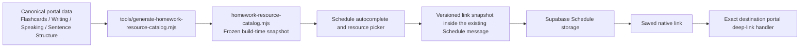

# Homework Resource Catalogue — Operations Standard Operating Procedure

**System:** EdmundEducation Homework & Revision Schedule  
**Repository:** `sambusinessdirectory-ops/edmundeducation.github.io`  
**Production site:** <https://edmundeducation.com/>  
**Document owner:** EdmundEducation  
**Effective date:** 27 July 2026  
**SOP version:** 1.0  
**Last technically verified against:** commit `18613dd03a5f2dbc03d6762608a81d8494eea29e`  
**Review frequency:** after any generator, deep-link, Schedule storage, or deployment-workflow change; otherwise at least quarterly

---

## 1. Purpose

This SOP defines the complete, repeatable procedure for adding, changing, removing, regenerating, testing, deploying, verifying, troubleshooting, and rolling back resources in the Homework System resource catalogue.

The catalogue supplies exact exercise links for these Schedule slot options:

1. **Flash Cards**
2. **Fill in the blanks** in Writing Practice
3. **Speaking**
4. **Sentence Structure**

The objective is that an administrator can add an exact exercise to a Homework slot and a student can later open that exact exercise—not merely the portal homepage—without exposing unsafe or external URLs.

This document is intentionally detailed. Do not skip a step merely because a deployment appears simple. A catalogue can generate successfully while still containing a target that the destination portal cannot open.

---

## 2. What “automatically regenerates” means

The resource catalogue is a **build-time snapshot**. It is not a live crawler and it does not continuously query Supabase, Cloudflare R2, or the public website.

On every GitHub Pages deployment, the workflow runs:

```bash
node tools/generate-homework-resource-catalog.mjs
```

The generator reads approved static source files in the repository and writes:

```text
homework-resource-catalog.mjs
```

Only then does the deployment workflow copy the site into the Pages artifact.

Therefore, a new exercise becomes automatic **only if all of the following are true**:

- It exists in a source format the generator recognises.
- Its source file follows the required filename/loading rules.
- The destination portal itself loads and recognises the same stable ID.
- The change is committed and pushed.
- A matching GitHub Pages deployment completes successfully.
- Production is verified after cache-busting.

Adding a row directly to Supabase, uploading a file to R2, or creating an unreferenced JavaScript data file does not automatically add a Homework resource.

---

## 3. System architecture



### 3.1 Core files

| Responsibility | File |
|---|---|
| Generated catalogue | `homework-resource-catalog.mjs` |
| Catalogue generator | `tools/generate-homework-resource-catalog.mjs` |
| Type definitions, autocomplete, filtering, URL allowlist, marker parsing/serialization | `schedule-homework-links.mjs` |
| Schedule picker, attachment, save, Mass Edit, rendering, printing, and navigation integration | `schedule-system.js` |
| Schedule picker and autocomplete UI | `schedule-system.html` |
| Main catalogue regression test | `tools/test-schedule-homework-links.mjs` |
| GitHub Pages deployment | `.github/workflows/pages.yml` |

### 3.2 Current verified baseline

As of the verification commit above:

| Resource type | Count |
|---|---:|
| Flashcards | 804 |
| Fill in the blanks / Writing Practice | 310 |
| Speaking | 787 |
| Sentence Structure | 218 |
| **Total** | **2,119** |

Additional baseline facts:

- Unique final resource IDs: **2,119**
- Non-empty IELTS Task 2 Flashcard decks: **232**
- Generated catalogue size: approximately **709,321 bytes**
- Production Pages cache currently advertises up to approximately **600 seconds**

These counts are a baseline, not permanent targets. Every intentional change must explain its exact count delta.

---

## 4. Roles and responsibilities

One person may perform several roles, but each responsibility must still be completed.

| Role | Responsibility |
|---|---|
| Content editor | Adds or corrects the canonical portal exercise data and preserves stable IDs. |
| Catalogue operator | Regenerates the catalogue, verifies count deltas, checks collisions, and updates pinned test expectations. |
| Reviewer | Confirms the source change, generated link, target deep link, and absence of unrelated changes. |
| Release operator | Commits, pushes, monitors the matching Pages run, and verifies production. |
| Incident owner | Stops rollout, assesses impact, chooses hotfix or revert, and records recovery evidence. |

Passwords, session tokens, Supabase service keys, signed R2 URLs, and student data must never appear in the catalogue, commit messages, test output, or release record.

---

## 5. Non-negotiable system invariants

Every release must preserve these rules.

1. `homework-resource-catalog.mjs` is generated. **Never edit it by hand.**
2. Each resource has one stable, globally unique catalogue ID.
3. Each destination uses HTTPS on `edmundeducation.com`.
4. Each resource URL contains exactly one approved query parameter.
5. The destination portal recognises the same stable ID.
6. Existing saved Homework slots remain readable and compatible.
7. The complete serialized Schedule message remains at or below 2,000 characters.
8. Invalid or malformed saved data is never silently destroyed.
9. Saved links remain native keyboard-focusable `<a>` elements.
10. Catalogue generation is byte-for-byte deterministic.
11. The tracked catalogue matches freshly generated source output.
12. Production verification is tied to the exact pushed commit SHA, not merely the latest green workflow shown in the interface.

---

## 6. Catalogue record contract

Every generated record contains exactly these fields:

```js
{
  id: "type-prefix:stable-source-id",
  type: "one-of-the-approved-types",
  label: "Human-readable picker title",
  detail: "Searchable supporting context",
  url: "approved-page.html?approvedParameter=encoded-stable-id"
}
```

The generated array and each record are frozen with `Object.freeze()`.

### 6.1 Approved types and URL contracts

| Type | Required ID prefix | Exact destination | Sole query parameter |
|---|---|---|---|
| `flashcards` | `flash:` | `/flashcards.html` | `deck` |
| `fill-blanks` | `fill:` | `/writing-practice.html` | `exercise` |
| `speaking` | `speaking:` | `/speaking-system.html` | `exercise` |
| `sentence-structure` | `sentence:` | `/sentence-structure.html` | `lesson` |

### 6.2 Normalisation limits

- Resource ID: trimmed and capped at 240 characters by Schedule validation.
- Label: whitespace-normalised and capped at 180 characters.
- Writing/Sentence supporting detail: capped at 140 characters.
- Flashcard deep-link handler currently permits deck IDs up to 500 characters.
- Writing and Speaking handlers permit IDs up to 240 characters.
- Sentence Structure handler permits lesson IDs up to 80 characters.

Design new IDs to satisfy the narrowest applicable destination limit.

### 6.3 Stable-ID policy

Treat each source ID as a permanent public contract.

- Do not rename an existing deck, exercise, or lesson ID merely to improve formatting.
- Correct display wording in `label`, `title`, or source metadata instead.
- Search the entire repository before introducing a new ID.
- If an ID must change, preserve a compatibility alias in the destination portal or plan a controlled migration of existing Schedule messages.
- Never reuse a retired ID for a different exercise.

Why this matters: a saved Homework slot stores a snapshot of the resource’s `id`, `type`, `label`, and `url`. It does not dynamically look up the latest catalogue record when the slot renders.

Consequences:

- A later label correction affects newly attached links only.
- An old slot can retain an earlier label and URL.
- Removing a resource from the current catalogue does not remove old saved markers.
- Removing or renaming the destination exercise can turn old links into dead links.
- Tightening the allowlist or prefix rule can make old markers invalid.

---

## 7. Source discovery rules by portal

### 7.1 Flashcards

#### Generator discovery

The generator evaluates:

1. The inline `window.EDMUND_FLASHCARD_SEED` assignment in `flashcards.html`.
2. Every root-level file whose name matches:

```text
flashcards-*-data.js
```

Matching files are evaluated alphabetically. Only seed values that are non-empty arrays become resources.

Generated format:

```js
{
  id: `flash:${deckId}`,
  type: "flashcards",
  label: exactTitle || humanizeDeckId(deckId),
  detail: `${humanizeDeckId(deckId)} · ${cards.length} cards`,
  url: `flashcards.html?deck=${encodeURIComponent(deckId)}`
}
```

#### Flashcard authoring requirements

- Use a stable deck key.
- Register a non-empty array in `window.EDMUND_FLASHCARD_SEED`.
- Use a root filename matching `flashcards-*-data.js` when the deck is external to the inline seed.
- Confirm the Flashcards application itself loads the file. Generator discovery alone is not proof that the portal can open it.
- If the file is lazy-loaded, test the direct link in a completely fresh page session.

#### Special labels

- IELTS Writing Task 2 uses real question wording from `window.EDMUND_IELTS_WRITING_TASK2` when the deck ID exactly matches its `type/ref` mapping.
- IELTS Reading Passage 1 uses `window.EDMUND_IELTS_READING_PASSAGE_1_TITLES` when available.
- Other deck IDs are humanised from their path segments.

If an IELTS Task 2 item displays an internal path instead of a real question, the deck ID and canonical question mapping do not match, or the canonical row lacks `ref`/`question`.

#### Flashcard collision risk

JavaScript object assignment can overwrite an earlier deck with the same key before the final catalogue duplicate check sees it. Before adding a deck, run:

```bash
rg -nF 'EXACT_NEW_DECK_ID' flashcards.html flashcards-*-data.js
```

More than one canonical definition is a release blocker unless the duplication is a deliberate, reviewed merge into the same deck.

### 7.2 Fill in the blanks / Writing Practice

#### Generator discovery

The generator reads local `<script src>` values from `writing-practice.html` and evaluates files whose names match:

```regex
^writing-practice-.*-data\.js$
```

Cache-busting query strings are removed before the file is read. External script URLs are ignored.

For each evaluated `window` global, the generator examines object values. A nested object becomes a resource when it has both a non-empty `id` and `title`.

Generated format:

```js
{
  id: `fill:${exercise.id}`,
  type: "fill-blanks",
  label: compactText(exercise.title),
  detail: compactText([exercise.exam, exercise.taskType].filter(Boolean).join(" · "), 140),
  url: `writing-practice.html?exercise=${encodeURIComponent(exercise.id)}`
}
```

#### Writing authoring requirements

- File name matches `writing-practice-.*-data.js`.
- File is included by a local `<script src>` in `writing-practice.html`.
- Data is published on `window` as an object.
- Each exercise is an object value with a stable `id` and non-empty `title`.
- The same global is included in the `writingExercises` runtime aggregation in `writing-practice.html`.
- `exerciseById()` can find the ID.
- `sectionKeyForWritingExercise()` maps it to a valid access section.

Merely creating the file and script tag is insufficient if the Writing Practice runtime aggregation or section mapping does not recognise the exercise.

#### Writing collision risk

The generator collects Writing exercises in a `Map` keyed by `exercise.id`. A later script can silently replace an earlier exercise with the same ID before the final duplicate-ID check.

Before adding an exercise:

```bash
rg -nF 'EXACT_NEW_EXERCISE_ID' writing-practice*.js writing-practice.html
```

The intended result is one canonical definition plus legitimate routing/reference occurrences.

### 7.3 Speaking

#### Generator discovery

The generator reads local script tags in `speaking-system.html` matching:

```regex
^speaking-system(?:-.*)?-data\.js$
```

It examines evaluated globals containing a `.books` array. A book must supply a valid numeric part and book number; each exercise must supply an ID.

Only visible books are indexed. Visibility is parsed from this declaration in `speaking-system.js`:

```js
const VISIBLE_BOOK_LIMITS = { 1: 14, 2: 16, 3: 16 };
```

Generated format:

```js
{
  id: `speaking:${exercise.id}`,
  type: "speaking",
  label: compactText(exercise.title || exercise.topic || fallback),
  detail: `IELTS Speaking · Part ${part} · Book ${bookNumber} · Exercise ${index}`,
  url: `speaking-system.html?exercise=${encodeURIComponent(exercise.id)}`
}
```

#### Speaking authoring requirements

- File name and local script tag match the discovery rule.
- The global has a supported `books` structure.
- Every book has a numeric `part` and `book`.
- Every exercise has a globally stable ID.
- The runtime `speakingBooks()` aggregation can see the new global.
- The book is within `VISIBLE_BOOK_LIMITS` if it is meant to be public.

Keep the visibility constant in a simple, parseable object declaration. If its code structure changes, update and test the generator in the same release; otherwise the generator’s fallback can expose more books than intended.

### 7.4 Sentence Structure

#### Generator discovery

The generator reads local script tags in `sentence-structure.html` matching its Sentence Structure data/lesson filename pattern. The final evaluated source must expose:

```js
window.EDMUND_SENTENCE_STRUCTURE_DATA.lessons
```

Generated format:

```js
{
  id: `sentence:${lesson.id}`,
  type: "sentence-structure",
  label: compactText(lesson.titleZh || lesson.title || lesson.titleEn || fallback),
  detail: compactText(lesson.titleEn || fallback, 140),
  url: `sentence-structure.html?lesson=${encodeURIComponent(lesson.id)}`
}
```

#### Sentence Structure authoring requirements

- The source file is included locally in `sentence-structure.html`.
- The filename matches the generator pattern.
- Loading order preserves the final `EDMUND_SENTENCE_STRUCTURE_DATA` object.
- The new lesson is present in its final `.lessons` array.
- The lesson has a stable ID no longer than 80 characters.
- The Sentence Structure runtime `getLesson()` can find it.

---

## 8. Generator mechanics

The generator:

1. Uses the website directory as its root.
2. Evaluates trusted data files in a Node VM containing a `window` object.
3. Enforces a 20-second evaluation timeout per file.
4. Builds the four resource collections.
5. Sorts the combined result by resource `type`, then English-locale numeric-aware `label`.
6. Rejects duplicate final resource IDs.
7. Writes a frozen, deterministic ES module.

Data source files must therefore be deterministic and declarative. They should not require:

- DOM APIs
- Supabase startup
- Network requests
- Timers
- user input
- random values
- current dates
- side effects outside publishing their data on `window`

The VM timeout is a protection against runaway evaluation, not a security boundary for untrusted code. Only reviewed repository source may be evaluated.

---

## 9. Schedule autocomplete and picker behaviour

The trigger priority is:

1. Flash Cards
2. Fill in the blanks
3. Speaking
4. Sentence Structure

Expected behaviour:

| Typed text at a valid word boundary | Suggestion |
|---|---|
| `F` | Flash Cards |
| `Fi` | Fill in the blanks |
| `S` | Speaking |
| `Se` | Sentence Structure |

Matching is:

- case-insensitive;
- aware of the cursor position;
- valid only at the beginning or after whitespace/punctuation;
- resolved by longest matching prefix, then the declared priority.

Pressing **Tab** accepts the translucent completion. When the exact full trigger is immediately before the cursor, the matching picker opens. Continuing normal prose closes it. Deleting back to the complete trigger reopens it.

Picker search:

- filters only the selected resource type;
- normalises Unicode with NFKC;
- lowercases the search;
- splits the query into tokens;
- requires every token to occur in combined `label + detail + id`;
- shows no more than 60 results at once while reporting the complete match count.

Selected resources appear as removable attachment chips in the editor.

---

## 10. Schedule persistence format

There is no separate Homework-resource database table. The system stores the visible Schedule text and resource snapshots together in the existing Schedule message field.

Each selected resource is serialized as a versioned Base64URL JSON marker:

```text
[[@edmund-homework:v1:<base64url-json>]]
```

The marker’s decoded snapshot contains:

```json
{
  "id": "...",
  "type": "...",
  "label": "...",
  "url": "..."
}
```

Properties of this design:

- Legacy text-only Schedule messages remain compatible.
- Valid markers are removed from visible slot text.
- Duplicate resources are removed by resource ID.
- Malformed markers remain visible rather than being silently deleted.
- All values are revalidated before use.
- Mass Edit preserves the same serialized message.
- Print/PDF shows readable link labels, not internal markers.
- A slot displays at most its first three links directly on the calendar, but reopening the slot shows all selected attachments.

### 10.1 Capacity limits

- Nominal maximum resources per slot: **12**
- Maximum complete saved Schedule message: **2,000 characters**
- Encoded marker overhead counts toward the 2,000-character limit.

The practical attachment limit may therefore be lower than 12. The UI checks the exact serialized size when an attachment is selected and checks it again when Save is pressed.

Do not raise this limit only in the browser. Any increase requires a coordinated review of the Supabase column, functions/RPCs, Worker payload validation, Mass Edit logic, tests, and backward compatibility.

---

## 11. URL security boundary

Every catalogue and saved resource is revalidated before rendering.

Accepted links must:

- resolve to origin `https://edmundeducation.com`;
- use one of the four exact allowlisted paths;
- contain the correct non-empty query parameter;
- contain no other query parameter names;
- contain no username or password URL components.

Do not weaken these rules to permit arbitrary URLs. If a new portal must be linked, add a new reviewed resource type and exact route contract as described later in this SOP.

Rendering rules:

- Links are native `<a>` elements.
- They are siblings of the slot button, never nested inside it.
- They retain keyboard focus and normal modifier-click behaviour.
- Dragging the link itself is disabled so it does not conflict with slot dragging.
- Link activation is blocked while selection, move, or mutation modes are active.
- Visible labels are inserted with safe DOM text operations rather than HTML injection.

Never add signed expiring URLs, credentials, private object URLs, or user-generated external destinations to the catalogue.

### 11.1 Destination runtime gates

Catalogue presence does not bypass portal authentication or section permissions. Each target performs its own existence and access checks after student login.

| Portal | Runtime acceptance conditions |
|---|---|
| Flashcards | Student role; deck ID no longer than 500 characters; deck contains usable cards; `canAccessDeck()` permits it; then `openDeckStart()` opens it. |
| Writing Practice | Student role; exercise ID no longer than 240 characters; `exerciseById()` finds it; `sectionKeyForWritingExercise()` resolves it; the student has that section. |
| Speaking | Student role; exercise ID no longer than 240 characters; exercise exists in a visible book; its route is allowed for the student. |
| Sentence Structure | Student role; lesson ID no longer than 80 characters; `getLesson()` finds it; then page 1 opens. |

The query string remains in the URL while the user logs in, and the portal attempts to open it after a valid student session is restored. These handlers intentionally auto-open for student accounts, not administrator views. Acceptance testing must therefore use a student account with the intended permissions, followed by a separate student account without those permissions.

An “access unavailable” message is different from “resource does not exist”:

- **Access unavailable** normally means the link and source are valid but the account lacks the required section.
- **Resource does not exist** normally means source/runtime registration differs, the ID is wrong, the content is empty, or a lazy source was not loaded.

---

## 12. Standard end-to-end operating procedure

Complete every subsection for each release.

### 12.1 Prepare a safe workspace

On the current primary machine:

```bash
cd /Users/sammak/Documents/Codex/2026-07-14/he/work/site
git status --short --branch
git fetch origin
git pull --ff-only origin main
git rev-parse HEAD
node --version
```

Expected Node version at the last verification was `v22.12.0`. A compatible modern Node release is required for ES modules, VM evaluation, and the test scripts.

Stop if:

- there are unexplained uncommitted files;
- the local branch has diverged;
- `git pull --ff-only` cannot complete;
- the source data being edited belongs to another unfinished change.

Preserve unrelated work. Never use `git reset --hard` as a routine preparation step.

Record the starting SHA in the release record.

### 12.2 Classify the change

Choose one category:

| Category | Examples | Required attention |
|---|---|---|
| Content addition | New deck/exercise/lesson | Stable ID, source discovery, target runtime, count increase |
| Metadata correction | Correct title/detail without changing ID | Search display and snapshot behaviour |
| Content removal | Retire exercise | Existing saved links and compatibility plan |
| ID/route change | Rename an ID or query contract | Major migration; never treat as content-only |
| Generator change | Modify source parsing/sorting/schema | Full four-portal regression and deterministic-output review |
| New resource type | Add another portal family | Security allowlist, extraction, UI, persistence, target handler, tests |

### 12.3 Add or update the canonical portal content

Edit the real portal source, not the generated catalogue.

For every new item:

1. Choose a stable ID.
2. Search the repository for that exact ID.
3. Add the canonical resource data.
4. Ensure the source file name matches the generator rule.
5. Add or confirm the required local script tag where applicable.
6. Add or confirm the destination portal’s runtime aggregation.
7. Add or confirm access-section mapping.
8. Confirm the destination’s deep-link handler can find the ID.
9. Confirm the student permissions model allows the intended audience.
10. If a browser-loaded data bundle changed, increment its `<script src>` `?v=` cache key so production browsers do not combine a new catalogue with an old cached portal dataset.

Run collision searches before continuing:

```bash
rg -nF 'EXACT_NEW_ID' .
```

Do not interpret every repeated reference as a collision. A canonical definition, a route mapping, and a test reference are legitimate. Two competing canonical definitions are not.

### 12.4 Validate changed source files

Run syntax checks for every changed JavaScript data file:

```bash
node --check path/to/changed-data-file.js
```

Confirm local data script inclusion where required:

```bash
rg -n '<script[^>]+src=' writing-practice.html
rg -n '<script[^>]+src=' speaking-system.html
rg -n '<script[^>]+src=' sentence-structure.html
```

For Flashcards, confirm seed registration and runtime loading:

```bash
rg -n 'EDMUND_FLASHCARD_SEED' path/to/changed-flashcard-file.js
rg -nF 'EXACT_NEW_DECK_ID' flashcards.html flashcards-*-data.js
```

### 12.5 Generate a non-destructive preview

Before overwriting the tracked catalogue:

```bash
node tools/generate-homework-resource-catalog.mjs \
  --output /tmp/homework-resource-catalog.preview.mjs
```

Inspect counts and uniqueness:

```bash
node --input-type=module -e '
const { pathToFileURL } = await import("node:url");
const { HOMEWORK_RESOURCE_CATALOG: c } =
  await import(pathToFileURL("/tmp/homework-resource-catalog.preview.mjs"));
const types = [...new Set(c.map(row => row.type))].sort();
console.log(JSON.stringify({
  total: c.length,
  counts: Object.fromEntries(types.map(type => [
    type,
    c.filter(row => row.type === type).length
  ])),
  uniqueIds: new Set(c.map(row => row.id)).size
}, null, 2));
'
```

Confirm:

- `total` equals `uniqueIds`;
- the intended type changes by the expected number;
- unrelated types do not shrink;
- no hidden Speaking books appear;
- no empty Flashcard deck appears;
- new labels are human-readable;
- URLs target the exact intended portal and parameter.

Find each intended item:

```bash
rg -n 'EXPECTED_RESOURCE_ID|EXPECTED_VISIBLE_TITLE' \
  /tmp/homework-resource-catalog.preview.mjs
```

If an addition unexpectedly leaves the total unchanged, assume a source-level ID overwrite until proven otherwise.

### 12.6 Regenerate the tracked catalogue

After the preview is correct:

```bash
node tools/generate-homework-resource-catalog.mjs
```

The current unchanged baseline prints:

```text
Wrote 1896 homework resources to homework-resource-catalog.mjs
```

The expected number after a release is:

```text
previous total + reviewed additions - reviewed removals
```

Never repair incorrect generated output manually. Fix the canonical source or generator and rerun it.

### 12.7 Prove deterministic generation

Generate two independent temporary files:

```bash
node tools/generate-homework-resource-catalog.mjs \
  --output /tmp/homework-resource-catalog.first.mjs

node tools/generate-homework-resource-catalog.mjs \
  --output /tmp/homework-resource-catalog.second.mjs

cmp homework-resource-catalog.mjs \
  /tmp/homework-resource-catalog.first.mjs

cmp /tmp/homework-resource-catalog.first.mjs \
  /tmp/homework-resource-catalog.second.mjs
```

Both `cmp` commands must be silent and return exit code 0.

If output differs between runs, stop. Search for non-deterministic source ordering, dates, random values, environment-dependent logic, or unstable locale behaviour.

### 12.8 Review the generated diff

```bash
git diff --stat -- homework-resource-catalog.mjs
git diff -- homework-resource-catalog.mjs
git diff --check
```

Review every addition/removal when the change is small. For a large intended import, use count scripts, ID lists, type-specific comparisons, and representative samples; do not rely only on the diff summary.

Verify:

- intended IDs only;
- correct ID prefix;
- correct resource type;
- readable label;
- useful detail text;
- correct percent-encoded destination;
- no external or signed URL;
- no accidental mass removal;
- no unexpected relabelling of existing resources;
- no unrelated files changed.

### 12.9 Update pinned regression counts deliberately

`tools/test-schedule-homework-links.mjs` intentionally pins the current counts and representative resources.

When a legitimate change alters a count:

1. Calculate the old-to-new delta independently.
2. Identify every added/removed resource ID.
3. Explain any decrease.
4. Update only the affected expectation.
5. Add or update a representative sentinel assertion when the new family is important.

Do not replace every expected count with whatever the generator produced. Count assertions are designed to catch accidental omissions and visibility leaks.

Current pinned categories:

- Flashcards: 804
- Fill in the blanks: 310
- Speaking: 787
- Sentence Structure: 218
- Non-empty IELTS Task 2 Flashcard decks: 232

### 12.10 Run mandatory automated tests

Minimum gate for every catalogue release:

```bash
node tools/test-schedule-homework-links.mjs
node tools/test-schedule-system.mjs
node tools/test-schedule-worker.mjs
node tools/test-shared-system-nav.mjs
git diff --check
```

The catalogue test verifies:

- current counts;
- unique IDs;
- representative known resources;
- real IELTS question labels;
- Speaking visibility limits;
- same-origin URL allowlisting;
- autocomplete and Tab behaviour;
- marker round-trip;
- legacy-message preservation;
- 2,000-character serialized-message budget;
- deterministic generation;
- exact equality between sources and tracked catalogue;
- Mass Edit integration;
- native accessible anchors;
- all four deep-link query contracts;
- generator execution before Pages file copying.

Also run the affected portal’s tests.

#### Flashcard source or route change

```bash
node tools/test-flashcard-deck-modes.mjs
node tools/test-flashcard-study-interactions.mjs
node tools/test-flashcard-preferences.mjs
```

Run data-family-specific Flashcard tests when applicable, such as the IELTS Reading or DSE Paper 3 tests in `tools/`.

#### Writing source or route change

```bash
node tools/test-writing-translation-toggle.mjs
node tools/test-writing-progression.mjs
node tools/test-essay-portal-links.mjs
```

#### Speaking source or route change

```bash
node tools/test-speaking-progress-dashboard.mjs
node tools/test-speaking-exam-mode.mjs
```

#### Sentence Structure source or route change

```bash
node tools/test-sentence-structure-system.mjs
```

The Sentence Structure test may print a deliberately simulated temporary 502 while verifying rollback behaviour. Judge success by its final pass result.

Important: the Pages workflow regenerates the catalogue but currently does **not** run this full test suite. Local testing before push is mandatory.

### 12.11 Perform local browser smoke testing

If the portal authentication environment supports local testing, serve the site:

```bash
python3 -m http.server 4173
```

Open:

```text
http://127.0.0.1:4173/schedule-system.html
```

If local authentication is unavailable because of CORS or network configuration, complete static tests locally and perform the authenticated smoke test immediately after deployment using an authorised test account.

#### Autocomplete and picker test

1. Open a new editable Schedule slot.
2. Type `F`; verify **Flash Cards** appears translucently.
3. Clear the text and type `Fi`; verify **Fill in the blanks**.
4. Clear the text and type `S`; verify **Speaking**.
5. Clear the text and type `Se`; verify **Sentence Structure**.
6. Press Tab for each trigger and verify the intended full phrase is inserted.
7. Type a complete trigger without Tab and verify the picker opens, supporting touch/mobile users.
8. Continue typing ordinary prose and verify the picker closes.
9. Delete back to the exact trigger and verify it reopens.
10. Search by title, year, resource ID fragment, and detail.
11. Verify the reported total and first 60-result display behaviour.

#### Attachment persistence test

1. Select the new resource.
2. Verify its attachment chip appears.
3. Attempt to select it again and verify duplication is rejected.
4. Save the slot.
5. Verify a clickable link appears below the slot.
6. Reopen the slot.
7. Verify the visible text contains no internal marker.
8. Verify the attachment remains.
9. Remove the attachment, save, and verify removal.
10. Repeat an add/save through Mass Edit.
11. Export/print and verify readable labels appear without raw markers.
12. Open a legacy slot without markers and verify it is unchanged.

#### Exact destination test

1. Open the saved link in a fresh browser tab.
2. Authenticate as an authorised student if prompted.
3. Verify the exact deck, exercise, or lesson opens.
4. Verify it does not stop at the portal homepage.
5. Verify a student without the necessary access receives the portal’s normal access warning.
6. Test keyboard activation.
7. Test Command/Ctrl-click opening in a new tab.
8. Test a phone/tablet viewport.

Delete any temporary Schedule slot after verification.

### 12.12 Final change review

```bash
git status --short
git diff --stat
git diff --check
git diff -- tools/generate-homework-resource-catalog.mjs
git diff -- tools/test-schedule-homework-links.mjs
git diff -- homework-resource-catalog.mjs
```

Look specifically for:

- accidental removal of many resources;
- unexpected ID changes;
- internal IDs used as public labels;
- unintended Speaking visibility changes;
- external URLs or extra parameters;
- hand edits to the generated output;
- unrelated user work.

### 12.13 Commit and push

Stage only reviewed files:

```bash
git add path/to/canonical-source-file \
  homework-resource-catalog.mjs \
  tools/test-schedule-homework-links.mjs
```

Stage the generator, target portal, Schedule integration, or workflow only if those files intentionally changed.

Review the staged result:

```bash
git diff --cached --check
git diff --cached --stat
git diff --cached
```

Commit and push:

```bash
git commit -m "Refresh homework resource catalogue"
git push origin main
git rev-parse HEAD
```

Record the final SHA. Do not bundle unrelated changes into the catalogue release.

### 12.14 Monitor the matching GitHub Pages deployment

Workflow:

```text
.github/workflows/pages.yml
```

Triggers:

- push to `main`;
- manual `workflow_dispatch`.

Deployment sequence:

1. Checkout.
2. Configure Pages.
3. Regenerate the Homework resource catalogue.
4. Copy site files into `_site`.
5. Report artifact size.
6. Upload the Pages artifact.
7. Deploy the artifact.

`tools/`, Workers, and SQL files are excluded from the public artifact. The generated root-level `homework-resource-catalog.mjs` is included.

The workflow’s regeneration happens only inside its temporary runner. GitHub Actions does **not** commit the refreshed file back to the repository. Always regenerate and commit the tracked catalogue locally before pushing; otherwise production may contain a newer generated asset than the repository copy used by local development and review.

If GitHub CLI is installed and authenticated:

```bash
gh run list --workflow pages.yml --limit 5
gh run watch RUN_ID --exit-status
```

Public API fallback:

```bash
curl -fsS \
  'https://api.github.com/repos/sambusinessdirectory-ops/edmundeducation.github.io/actions/workflows/pages.yml/runs?per_page=5' \
  -o /tmp/pages-runs.json

node -e '
const data = require("/tmp/pages-runs.json");
console.log(data.workflow_runs.map(run => ({
  id: run.id,
  head_sha: run.head_sha,
  status: run.status,
  conclusion: run.conclusion,
  html_url: run.html_url,
  updated_at: run.updated_at
})));
'
```

Acceptance conditions:

- `head_sha` equals the final SHA recorded earlier.
- `status` is `completed`.
- `conclusion` is `success`.
- The Deploy to GitHub Pages step succeeded.

Do not accept a green run for an older commit.

The workflow uses a shared Pages concurrency group and cancels in-progress earlier runs. If several commits are pushed quickly, monitor the newest SHA.

### 12.15 Verify production with cache-busting

Use a unique query because GitHub Pages may serve a cached copy:

```bash
VERIFY_ID=$(git rev-parse HEAD)

curl -fsS \
  "https://edmundeducation.com/homework-resource-catalog.mjs?v=$VERIFY_ID" \
  -o /tmp/homework-resource-catalog.live.mjs
```

Compare production byte-for-byte with the tracked file:

```bash
cmp homework-resource-catalog.mjs \
  /tmp/homework-resource-catalog.live.mjs
```

Silent exit code 0 is required.

For a recorded digest:

```bash
shasum -a 256 \
  homework-resource-catalog.mjs \
  /tmp/homework-resource-catalog.live.mjs
```

Both hashes must match.

Count the live catalogue:

```bash
node --input-type=module -e '
const { pathToFileURL } = await import("node:url");
const { HOMEWORK_RESOURCE_CATALOG: c } =
  await import(pathToFileURL("/tmp/homework-resource-catalog.live.mjs"));
const types = [...new Set(c.map(row => row.type))].sort();
console.log(JSON.stringify({
  total: c.length,
  counts: Object.fromEntries(types.map(type => [
    type,
    c.filter(row => row.type === type).length
  ])),
  uniqueIds: new Set(c.map(row => row.id)).size
}, null, 2));
'
```

Search for every new production item:

```bash
rg -n 'EXPECTED_RESOURCE_ID|EXPECTED_VISIBLE_TITLE' \
  /tmp/homework-resource-catalog.live.mjs
```

Confirm the live Schedule bundle still imports both modules:

```bash
curl -fsS \
  "https://edmundeducation.com/schedule-system.js?v=$VERIFY_ID" \
  -o /tmp/schedule-system.live.js

rg -n 'homework-resource-catalog|schedule-homework-links' \
  /tmp/schedule-system.live.js
```

Finally, repeat the authenticated end-to-end smoke test on production with a harmless temporary slot, then remove it.

### 12.16 Close the release

Complete the release record in Appendix A and save it with the project’s normal operational records.

Definition of Done:

- source is correct;
- stable ID is collision-free;
- destination runtime opens it;
- catalogue is regenerated and committed;
- count delta is fully explained;
- deterministic output is proved;
- mandatory and portal-specific tests pass;
- browser smoke test passes;
- matching Pages run succeeds;
- live asset equals local output byte-for-byte;
- production exact link works;
- temporary verification data is removed;
- release evidence is recorded.

---

## 13. Special procedures

### 13.1 Correcting a label without changing the ID

1. Correct the canonical title/detail source.
2. Keep the stable ID unchanged.
3. Regenerate and test normally.
4. Confirm the count does not change.
5. Understand that old saved slots retain their original label snapshot.
6. If old labels must also change, plan a separate controlled data migration; do not silently rewrite stored messages from the browser.

### 13.2 Removing or retiring a resource

Before removal:

1. Identify whether existing Schedule slots may reference it.
2. Verify whether the destination can remain as a compatibility alias.
3. Decide whether to hide it only from new picker selections or delete the underlying content.
4. Record every removed resource ID.
5. Explain the exact count decrease.
6. Test a previously saved link.

Preferred approach: remove the item from new catalogue discovery while preserving a safe compatibility route for existing saved slots.

Do not reuse the retired ID for a different exercise.

### 13.3 Renaming an ID or changing a query parameter

This is a migration, not a routine catalogue refresh.

Required work:

1. Inventory existing Schedule messages that contain the old marker.
2. Back up affected data.
3. Add a compatibility alias or redirect in the destination portal.
4. Update generator output and allowlist only with backward compatibility.
5. Add tests for both old and new links.
6. Migrate saved messages only through a reviewed, idempotent procedure.
7. Verify a rollback path before production.

Never change the marker schema version, ID prefix, page path, or query parameter without this migration review.

### 13.4 Adding a completely new resource type

Complete all of the following:

1. Create or identify a stable same-origin destination page.
2. Define one exact query parameter that opens the exact resource.
3. Implement the target deep-link handler first.
4. Enforce authentication, existence checks, and student-access checks.
5. Add a unique resource `type`, trigger wording, and ID prefix to `HOMEWORK_RESOURCE_TYPES`.
6. Add the exact page to `ALLOWED_PAGE_BY_TYPE`.
7. Add the exact parameter to `EXPECTED_PARAMETER_BY_PAGE`.
8. Add the prefix rule in `normalizeHomeworkResource()`.
9. Add a deterministic source extractor to the generator.
10. Add it to the combined resource list.
11. Decide and document sorting, labels, detail text, and visibility rules.
12. Add count, representative ID, collision, URL safety, autocomplete, serialization, accessibility, print, Mass Edit, and deep-link tests.
13. Verify phone/tablet and keyboard behaviour.
14. Verify old `v1` markers still parse unchanged.
15. Perform the full end-to-end release process.

Do not add a generic “any URL” resource type.

### 13.5 Manual redeployment without a content change

Use `workflow_dispatch` only when the commit on `main` is already correct and a fresh Pages deployment is required.

With GitHub CLI:

```bash
gh workflow run pages.yml --ref main
```

Then monitor and verify the new run normally. A redeploy does not correct a bad commit; it republishes the same content.

---

## 14. Known limitation requiring explicit release attention

### Lazy-loaded IELTS Reading Passage 1 Flashcards

As of SOP version 1.0:

- The generator indexes **158** IELTS Reading Passage 1 Flashcard decks.
- Practice 1 is in the main inline Flashcard seed.
- The remaining **157** are supplied by the lazy-loaded `flashcards-ielts-reading-passage-1-data.js` file.
- The direct `?deck=` Homework handler checks `getDeckCards()` immediately.
- It does not currently await `ensureIeltsReadingPassage1Data()` before that existence check.

In a completely fresh Flashcards page session, a direct Homework link to one of those lazy decks can therefore report that the deck does not exist, even though it appears in the catalogue. It may work after the lazy dataset has already been loaded during that browser session.

Until the destination handler is updated and regression-tested:

1. Do not assume catalogue presence proves these 157 direct links work.
2. Test any assigned IELTS Reading Passage 1 link in a fresh/private session.
3. Avoid relying on a lazy deck for compulsory Homework if the fresh-session test fails.
4. The correct permanent fix is for the deep-link handler to load the lazy dataset before checking/opening a matching Passage 1 deck, followed by an automated regression test.

Do not hide this failure by manually removing generated rows without deciding whether the content should remain discoverable elsewhere.

---

## 15. Troubleshooting guide

| Symptom | Likely cause | Correct response |
|---|---|---|
| Generator reports a syntax error | Invalid canonical data file | Run `node --check` on the named file; fix the source; rerun. |
| Generator times out | Data file now performs application work or contains runaway logic | Remove DOM/network/timer/loop side effects; keep source declarative. |
| `Duplicate homework resource id` | Two generated resources share an ID | Search exact ID globally; correct canonical IDs; never patch output. |
| New Flashcard is absent | Wrong filename, missing/non-empty seed assignment, or overwritten ID | Verify `flashcards-*-data.js`, seed registration, cards array, collision search. |
| New Flashcard appears but target says nonexistent | Generator read a file the runtime did not load, or lazy data was not loaded | Fix runtime loading/deep-link preload; test in a fresh session. |
| IELTS Task 2 label shows an internal path | Deck key does not match canonical question `type/ref` | Correct the stable mapping while preserving valid existing IDs or add compatible mapping. |
| New Writing exercise is absent | Wrong filename, missing script tag/global/id/title | Check all Writing discovery and runtime aggregation requirements. |
| Writing link says exercise nonexistent | `exerciseById()` or runtime aggregation cannot find it | Add the global to `writingExercises`; test direct URL. |
| Writing link says access unavailable | `sectionKeyForWritingExercise()` is absent/wrong, or student lacks access | Fix section mapping or intended account access; do not weaken auth. |
| New Speaking exercise is absent | Unsupported `.books` shape, invalid IDs, or book outside visibility limit | Correct data shape or deliberate visibility constant. |
| Hidden Speaking books appear | Generator could not parse `VISIBLE_BOOK_LIMITS` | Restore parseable declaration or update generator and tests before release. |
| New Sentence lesson is absent | Not present in final `EDMUND_SENTENCE_STRUCTURE_DATA.lessons` | Fix script inclusion/loading order/final data object. |
| Test fails only on counts | Intended delta not reflected in pinned test, or unintended data drift | Account for every changed ID before updating one expectation. |
| Total does not increase after addition | Earlier source silently overwritten by duplicate ID | Search exact ID across all source files; resolve collision. |
| Tracked catalogue differs after regeneration | Tracked output is stale or canonical source changed | Review, test, and commit regenerated output. |
| Picker reports many results but only shows 60 | Expected display cap | Search with more specific title/year/ID/detail tokens. |
| Attachment rejected before 12 resources | Hidden marker overhead reached 2,000 characters | Shorten visible message or attach fewer resources. |
| Only three links appear on the calendar | Expected compact rendering | Reopen the slot to see all attachments. |
| Old slot shows an old label | Saved marker is a snapshot | Reattach or perform controlled migration if required. |
| Old marker text becomes visible | Resource no longer passes current validation or marker is malformed | Investigate compatibility; do not delete it automatically. |
| Link is blocked on click | Schedule is in selection, move, or mutation mode | Exit that mode and try again. |
| Workflow is green but production appears old | Wrong run SHA or Pages/browser cache | Match SHA; use unique `?v=`; compare bytes/hashes. |
| Earlier Pages run is cancelled | A newer push used the same concurrency group | Monitor the newest commit’s run. |
| Workflow generator fails | Canonical source/generator error | Previous successful site normally remains live; fix forward or revert and redeploy. |
| Redeploy does not remove a bad change | Redeploy republishes same bad commit | Revert/hotfix source, test, push a new commit. |

---

## 16. Rollback and recovery

### 16.1 Failure before push

Do not deploy. Correct the canonical source or generator. Preserve unrelated local work. Do not use destructive Git commands to erase unexplained changes.

### 16.2 Bad commit already pushed

Use a new revert commit on the shared branch:

```bash
git status --short --branch
git pull --ff-only origin main
git log --oneline -10
git revert --no-edit BAD_COMMIT_SHA
node tools/generate-homework-resource-catalog.mjs
node tools/test-schedule-homework-links.mjs
node tools/test-schedule-system.mjs
git diff --check
git push origin main
```

Then monitor and verify the rollback deployment using the new revert SHA.

If multiple commits must be reverted, inspect them individually and revert in reverse chronological order. Avoid rewriting published history.

### 16.3 Stale generated file only

If canonical sources are correct but the tracked catalogue is stale:

1. Regenerate it normally.
2. Review the full delta.
3. Run the mandatory tests.
4. Commit the generated correction.
5. Deploy and verify production.

Do not copy an old generated file over newer valid sources.

### 16.4 Broken existing saved links

1. Identify the affected stable IDs and marker version.
2. Determine whether the problem is target loading, route mapping, permission, allowlist validation, or deleted content.
3. Prefer a compatibility fix in the destination portal.
4. Back up data before any Schedule-message migration.
5. Make migrations idempotent and reversible.
6. Test legacy, malformed, and current markers.
7. Record affected student scope without exposing personal data.

---

## 17. Routine health audit

Run quarterly and after any major portal restructure.

1. Pull the latest clean `main`.
2. Regenerate to a temporary path twice.
3. Compare both outputs and the tracked catalogue.
4. Record total, per-type counts, and unique IDs.
5. Search for source-level duplicate IDs.
6. Verify every generated resource passes the same-origin validator.
7. Confirm Speaking limits are parsed correctly.
8. Confirm each HTML page still includes its canonical data scripts.
9. Run the mandatory and all four portal regression suites.
10. Sample at least five exact links per resource type.
11. Include one authorised and one unauthorised account check.
12. Include one desktop, one phone/tablet, and one keyboard-only check.
13. Test Mass Edit and print/PDF.
14. Test one legacy Schedule message.
15. Test one near-2,000-character serialized message.
16. Test the lazy IELTS Reading Passage 1 case in a fresh session.
17. Verify the Pages workflow still regenerates before copying `_site`.
18. Compare the production catalogue byte-for-byte.
19. Review open limitations and compatibility aliases.
20. Update this SOP’s baseline, version, verification SHA, and review date.

---

## 18. Release checklist

```text
[ ] Working tree reviewed; unrelated work preserved
[ ] Starting SHA recorded
[ ] Change category identified
[ ] Canonical portal source updated
[ ] Stable ID collision search completed
[ ] Destination runtime loads the source
[ ] Access-section mapping verified
[ ] Exact deep link works in a fresh session
[ ] Changed data files pass node --check
[ ] Non-destructive catalogue preview generated
[ ] Per-type count delta fully explained
[ ] Total equals unique ID count
[ ] Tracked catalogue regenerated locally
[ ] Deterministic generation proved twice
[ ] Generated diff reviewed
[ ] Pinned expected counts deliberately updated
[ ] Mandatory tests passed
[ ] Affected portal tests passed
[ ] Local/authenticated browser smoke test passed
[ ] Generated catalogue committed
[ ] No unrelated files staged
[ ] Final SHA recorded
[ ] Matching Pages workflow completed successfully
[ ] Production catalogue equals local file byte-for-byte
[ ] Live counts and new IDs verified
[ ] Production exact-link smoke test passed
[ ] Mobile/keyboard behaviour checked when relevant
[ ] Temporary verification slot removed
[ ] Known limitations/deferred issues recorded
[ ] Release record completed
```

---

## Appendix A — Release record template

Copy this section for every catalogue release.

```text
Homework Resource Catalogue Release Record

Date/time:
Operator:
Reviewer:
Reason/change ticket:

Repository:
Starting SHA:
Final SHA:
Last known-good SHA:

Change category:
Canonical source files changed:
Generator/route/workflow files changed:

Resource IDs added:
Resource IDs removed:
Resource IDs relabelled:
Compatibility aliases added:

Counts before:
  flashcards:
  fill-blanks:
  speaking:
  sentence-structure:
  total:

Counts after:
  flashcards:
  fill-blanks:
  speaking:
  sentence-structure:
  total:

Expected delta:
Actual delta:
Reason for every decrease:
Unique ID count:

Generator output:
Determinism comparison:
Source-level collision search:
git diff --check:

Tests executed and results:

Browser smoke-test environment/account role (no passwords):
Autocomplete/picker result:
Persistence result:
Mass Edit result:
Print/PDF result:
Exact destination result:
Unauthorised-access result:
Mobile/keyboard result:

GitHub Pages run ID:
GitHub Pages run URL:
Workflow head SHA:
Workflow conclusion:

Live catalogue HTTP status:
Local SHA-256:
Live SHA-256:
Live total and per-type counts:
Production exact-link result:

Temporary test data removed:
Known limitations/deferred issues:
Rollback required? If yes, revert SHA and result:

Operator sign-off:
Reviewer sign-off:
```

---

## Appendix B — Quick count command

From the website root:

```bash
node --input-type=module -e '
const { HOMEWORK_RESOURCE_CATALOG: c } =
  await import("./homework-resource-catalog.mjs?verify=" + Date.now());
const types = [...new Set(c.map(row => row.type))].sort();
console.log(JSON.stringify({
  total: c.length,
  counts: Object.fromEntries(types.map(type => [
    type,
    c.filter(row => row.type === type).length
  ])),
  uniqueIds: new Set(c.map(row => row.id)).size
}, null, 2));
'
```

---

## Appendix C — Glossary

| Term | Meaning |
|---|---|
| Canonical source | The portal’s real exercise/deck/lesson data from which the catalogue is derived. |
| Catalogue | The generated frozen list used by the Schedule picker. |
| Stable ID | Permanent identifier shared by source, catalogue, saved marker, and target route. |
| Deep link | URL that opens one exact resource after login and access checks. |
| Marker | Versioned Base64URL resource snapshot stored in the existing Schedule message. |
| Legacy message | Schedule message created before resource markers existed. |
| Deterministic generation | Identical source always produces byte-identical catalogue output. |
| Count delta | Difference between before/after resource counts, fully explained by reviewed changes. |
| Compatibility alias | Old ID/route retained so existing saved links continue to work. |
| Cache-busting | Unique query value used to avoid verifying a stale Pages/browser response. |
| Release blocker | A condition that must be corrected before deployment. |
